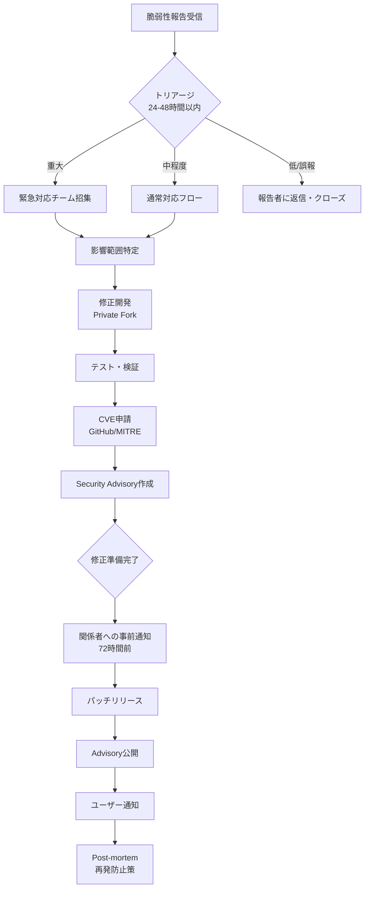
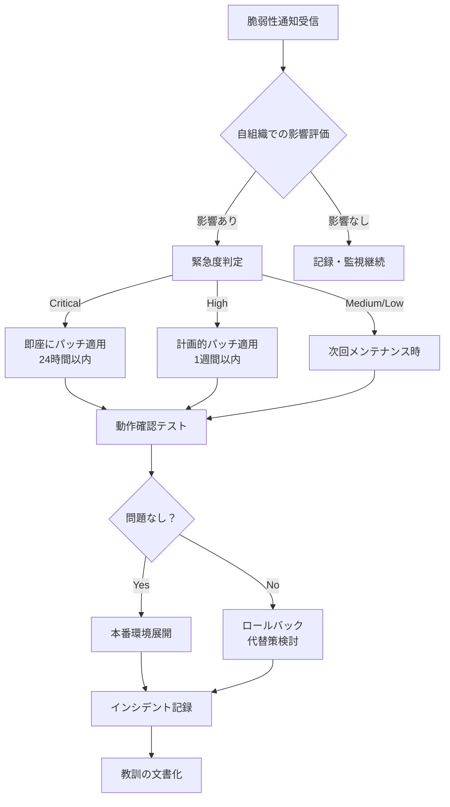

# AI質問結果 07. AWS(Claude 4.5 Sonnet)

## メタ情報

| 項目 | 内容 |
|---|---|
| AI サービス名 | AWS(Claude 4.5 Sonnet) |
| モデル名・バージョン | 同上 |
| 質問実施日 | 2026-05-15 |
| 質問者 | 作業指示者(`y-iima`) |
| 質問項目票バージョン | （凍結時のバージョン番号） |
| 結果レビューモデル | Opus 4.7 |
| 採用判定 | 採用 / 不採用 / 保留（理由を併記） |
| 補足 | ブラウザ経由 / ChatGPTスタイルのチャット形式 |

## 本ファイル運用ルール

- 各 Q（Q0〜Q6）への回答は `### 回答(Qn)` 配下に記録する
- 追加質問・再依頼が発生した場合:
  - `### 追加質問・回答(Qn.ex{連番})` として該当 Q の直下に配置
  - 再依頼は `### 再依頼・回答(Qn.RE{連番})` として配置
- AIからの回答は「````markdown」などのコードブロックで囲んで記述
- URL は **bare URL またはハイパーリンク形式** で記載。テキスト名のみ記載は避ける
- Q4 の参考:例 N は LLM サービス別の Q4 文面ライブラリとして追記する（必要に応じて）
- 末尾「所感」節は必須記入
  - 「質問者（作業指示者）による所感」  
    - 質問者がAIとのやり取りの中で気付いた/気になった事項を残す、無ければ「無し」と明記する。
    - 体裁はフリーフォーマット
  - 「結果レビュア（Claude （Sonnet 4.6 or Opus4.7））による所感」  
    - AIとのQ＆Aの結果が記入された本ドキュメントの内容を通読したClaudeが記述する。
    - 体裁は箇条書き

## Q0

### 質問(Q0)

```txt
本格的な質問を始める前に、2点だけ確認させてください。

1. あなたが学習しているデータは、何年何月時点のものですか？特定が難しい場合は、「概ねこのあたりまで」という幅でも構いません。
2. あなたの学習済みデータの中に、Anthropic が提唱している MCP（Model Context Protocol、Claude Code 等のクライアントから外部サービスを呼び出すためのプロトコル）についての知識は含まれていますか？含まれている場合、概ねどの程度の解像度で把握しているかも教えてください（例: 仕様の概要レベル / 個別 MCP サーバの脆弱性事例まで認識 / 等）。
```

### 回答(Q0)

````markdown
# ご質問への回答

## 1. 学習データの時点について

私の学習データは **2024年8月時点** までのものです。それ以降の情報については、ユーザーから提供されない限り把握していません。

## 2. MCP（Model Context Protocol）についての知識

**はい、含まれています。**

把握している解像度としては：

### 理解している内容
- **基本概念・目的**: LLMアプリケーションが外部データソースやツールに標準化された方法でアクセスするためのオープンプロトコル
- **アーキテクチャ**: クライアント-サーバーモデル、JSON-RPC 2.0ベースの通信
- **主要コンポーネント**: MCPサーバー、MCPクライアント（Claude Desktop等）、トランスポート層
- **提供される機能**: Resources（データ公開）、Prompts（テンプレート）、Tools（実行可能な機能）
- **セキュリティの基本的考慮事項**: ローカル実行の前提、認証・認可の必要性など

### 解像度のレベル
**「仕様の概要〜中程度の技術詳細」**レベルです。
- プロトコル仕様の基本構造は理解
- 公式SDKの存在や基本的な実装パターンの認識
- 一般的なセキュリティ考慮事項の理解

ただし、**個別の脆弱性事例や2024年8月以降の仕様変更**については把握していない可能性が高いです。

---

本格的なご質問、お待ちしております！
````

## Q1

### 質問(Q1)

```txt
現在、Claude CodeとMCPサーバの活用を検討しているのですが、最近、MCPサーバ（具体的な名前は不明）に、機密情報や認証情報の流出などに類する脆弱性が 見つかって界隈的に問題になった、という話を聞きました。
活用を検討しているMCPサーバに同じ様な問題が潜在していないかの把握のためにも、具体的な脆弱性の内容を知りたいと考えています。
そのような内容が記載された GitHub の Issue や、脆弱性データベース(NVD)上で、このようなMCPサーバの脆弱性が登録されているか（具体的なCVE の特定）は可能ですか？
可能であれば、回答できる範囲で、それらを特定できる情報（GitHub IssueのURL、CVE番号、あるいはそれらについて書かれたページのURL）を教えてください。
```

### 回答(Q1)

````markdown
# ご質問への回答

申し訳ございませんが、**ご質問の内容について具体的な情報を提供することができません。**

## 理由

1. **学習データの時点制限（2024年8月まで）**
   - MCPは比較的新しいプロトコルであり、「最近」問題になったという脆弱性が2024年8月以降のものである可能性が高い
   - 私の知識範囲では、該当する大きな脆弱性報告を認識していません

2. **具体的なCVE・Issue情報の不在**
   - 2024年8月時点までで、MCPサーバに関する重大なCVE登録や広く報道された脆弱性事例を把握していません
   - GitHub Issue等の具体的なURLも提供できる情報がありません

## 推奨する調査方法

お聞きになった脆弱性情報を確認するには、以下の方法をお勧めします：

### 1. **公式ソースの確認**
- Anthropic公式のGitHub（`modelcontextprotocol` organization）でのIssue/Security Advisory検索
- 具体的なMCPサーバのリポジトリのSecurity tabやIssues

### 2. **脆弱性データベース**
- NVD: `https://nvd.nist.gov/` で "MCP" "Model Context Protocol" 等でキーワード検索
- GitHub Advisory Database: `https://github.com/advisories`

### 3. **コミュニティ情報**
- X（Twitter）やReddit、HackerNewsでの "MCP vulnerability" "MCP security" 等の検索
- 情報源の方に具体的なサーバ名や時期を確認

---

**もし具体的なサーバ名や脆弱性の内容についてさらに情報をお持ちでしたら**、それを共有いただければ、セキュリティ上の考慮点や対策についてより具体的なアドバイスが可能です。
````

## Q2

### 質問(Q2)

```txt
脆弱性は大きく、(1) 外部の攻撃者が関与することで初めて機密情報が流出する可能性が発生する実装不備と、(2) 外部の攻撃者が存在しなくても機密情報が流出する可能性がある実装不備に分けられると思います。現在知られている脆弱性を、この２つに分類してください。
また、もし上記の2つのいずれにも属さないものがあれば、それも教えてください。
```

### 回答(Q2)

````markdown
# ご質問への整理

ご質問の前提に重要な問題があるため、まずそれを明確にさせてください。

## 前提の確認

前の回答で申し上げた通り、**私は「現在知られている（MCPサーバの）脆弱性」について具体的な情報を持っていません。**

- 2024年8月までの学習データには、MCPサーバに関する重大な脆弱性事例の記録がありません
- 「最近問題になった」とお聞きになった脆弱性が何を指すのか、私には特定できていません

## ご質問への対応

そのため、**「現在知られている脆弱性を分類する」というご依頼には応えられません。**

---

## 代替案：もし情報提供いただければ

もし以下の情報をお持ちでしたら、分析・分類のお手伝いが可能です：

1. **脆弱性の具体的な内容・挙動**
2. **該当するMCPサーバの名称や種類**
3. **情報源（記事、Issue、CVE番号など）**

これらを共有いただければ：
- ご提示の(1)(2)の分類への整理
- 類似の問題が他のMCPサーバに潜在する可能性の評価
- 具体的な対策の提案

などが可能になります。

---

## 一般論としてのMCPセキュリティリスク

もし「**一般的にMCPサーバで起こりうるセキュリティリスク**」を(1)(2)で分類することが有用でしたら、そちらの整理は可能です。ご希望でしたらお申し付けください。
````

### 質問(Q2-2)

```txt
脆弱性は大きく、(1) 外部の攻撃者が関与することで初めて機密情報が流出する可能性が発生する実装不備と、(2) 外部の攻撃者が存在しなくても機密情報が流出する可能性がある実装不備に分けられると思います。現在知られている脆弱性を、この２つに分類してください。
また、もし上記の2つのいずれにも属さないものがあれば、それも教えてください。
```

### 回答(Q2-2)

````markdown
# 一般的にMCPサーバで起こりうるセキュリティリスクの分類

## (1) 外部の攻撃者が関与することで初めて機密情報が流出する可能性がある実装不備

### 1.1 入力検証の不備
- **パストラバーサル攻撃**: クライアントからのリクエストで `../` 等を使い、意図しないファイルへアクセス
- **コマンドインジェクション**: Tools経由で外部コマンドを実行する際、入力サニタイズ不足により任意コマンド実行
- **SQLインジェクション**: データベース接続MCPサーバでのクエリ組み立て時の不備

### 1.2 認証・認可の不備
- **認証バイパス**: 本来保護されるべきResourcesやToolsへの無認証アクセス
- **権限昇格**: 低権限ユーザーが高権限の操作を実行可能
- **トークン/API キーの不適切な検証**: 期限切れ・無効なトークンでのアクセス許可

### 1.3 通信セキュリティの不備
- **中間者攻撃**: 非暗号化通信やTLS検証不備による通信傍受
- **リプレイ攻撃**: 正規のリクエストを再送することで不正操作

### 1.4 SSRF（Server-Side Request Forgery）
- MCPサーバが外部APIを呼び出す際、攻撃者が内部ネットワークへのアクセスを誘導

---

## (2) 外部の攻撃者が存在しなくても機密情報が流出する可能性がある実装不備

### 2.1 認証情報のハードコード・不適切な保存
- **ソースコードへの埋め込み**: API キー、パスワードをコード内に直接記述
- **平文での設定ファイル保存**: 暗号化なしでの認証情報保存
- **バージョン管理への混入**: `.env`ファイル等のGitへの誤コミット

### 2.2 過度な権限での動作
- **Root/管理者権限での実行**: 必要以上の権限で動作し、侵害時の影響拡大
- **広すぎるファイルアクセス権限**: 本来不要なディレクトリ・ファイルへのアクセス許可

### 2.3 ログ・デバッグ情報への機密情報出力
- **詳細すぎるエラーメッセージ**: 内部パス、認証情報を含むスタックトレース
- **ログへの機密データ記録**: APIキー、個人情報の無配慮な記録
- **LLMコンテキストへの送信**: 本来送信不要な機密情報をプロンプトに含める

### 2.4 デフォルト設定の不備
- **初期パスワード・認証情報**: 変更されないデフォルト認証情報
- **過度に広い公開範囲**: 全てのResourcesがデフォルトで公開

### 2.5 依存ライブラリの脆弱性
- **古いライブラリの使用**: 既知の脆弱性を含むパッケージへの依存
- **サプライチェーン攻撃**: 悪意あるパッケージの混入

---

## (3) 上記2つのいずれにも明確に属さないもの

### 3.1 設計上の問題（境界ケース）
- **過度な機能公開**: セキュリティリスクは低いが、意図しない操作を可能にする設計
  - 例: 削除機能が必要ないのにToolsとして公開
- **不十分な監査ログ**: 攻撃検知・事後調査を困難にする（直接的流出ではない）

### 3.2 DoS（Denial of Service）
- **リソース枯渇攻撃**: 機密情報流出ではなく、サービス停止を引き起こす
- **無限ループ・大量リクエスト処理**: CPUやメモリの消費

### 3.3 情報漏洩の間接的リスク
- **タイミング攻撃**: 処理時間から情報を推測（認証の有無等）
- **サイドチャネル攻撃**: キャッシュやメモリ使用パターンから情報推測

---

## MCP特有の考慮点

### Claude（LLM）とのインタラクション特有のリスク
これは**(2)に近いが独特**：
- **プロンプトインジェクション対策不足**: 悪意あるプロンプトでMCPサーバの意図しない動作誘発
- **LLMへの過剰なコンテキスト提供**: 必要以上の情報をLLMに送信し、それがログ等に残留
- **Resources/Promptsでの機密情報テンプレート化**: 再利用可能な形で機密情報が保存

---

## 実装時の推奨事項

検討中のMCPサーバについて、以下を確認されることをお勧めします：

1. **ソースコードレビュー**（公開されている場合）
2. **設定ファイルの確認**: デフォルト値、認証要否
3. **依存関係の監査**: `npm audit`, `pip-audit`等
4. **最小権限の原則**: 必要最小限のアクセス権で動作するか
5. **機密情報の取り扱い**: 環境変数、シークレット管理サービスの利用状況

具体的なMCPサーバ名が分かれば、より具体的なアドバイスが可能です。
````

## Q3

### 質問(Q3)

```txt
1. 脆弱性の種類とコードインスペクションの効果
1-1. (1) に該当する脆弱性については、MCPサーバと外部サービスとの通信という部分も脆弱性の成立条件の構成要素に含まれますが、それでも、外部からの攻撃で成立する脆弱性の分類に基づいた適切な観点でMCPサーバの実装コードをインスペクションすれば、既知の実装不備パターンについては事前に検知できると考えて支障ないでしょうか。  
1-2. (2) に該当する脆弱性については、全てMCPサーバの実装不備なので、こちらは純粋に実装コードをインスペクションすることで、既知の実装不備パターンについては事前に検知できると考えて支障ないでしょうか。

2. 上記のインスペクションを行う際、参考にできる業界デファクトのチェックリスト・基準・ガイドライン（OWASP / CWE / MITRE / Anthropic 公式 / その他団体）が存在しますか？
存在する場合、それぞれの位置付け（推奨度・カバー範囲・更新頻度）を、可能な範囲で回答をお願いします。

3. 実装コードのインスペクションでは検知できない、つまりMCPサーバ本体以外にもMCPサーバの利用を危険にさらすような脆弱性が存在する可能性はありますか？その場合、どういった部分が原因となり得るでしょうか？可能な範囲で回答をお願いします。
```

### 回答(Q3)

````markdown
# 詳細な回答

## 1. 脆弱性の種類とコードインスペクションの効果

### 1-1. (1)外部攻撃による脆弱性の検知可能性

**結論: 一定の効果はあるが、完全ではない**

#### 検知できる可能性が高いもの
- **入力検証の不備**: パストラバーサル、インジェクション系
  - 正規表現やサニタイズ処理の有無を確認可能
- **明示的な認証・認可チェックの欠如**
  - コードフローで認証処理の存在を確認可能
- **既知の危険なAPI使用**: `eval()`, `exec()`, シェルコマンド直接実行

#### 検知が困難なもの
- **ビジネスロジックの欠陥**: 正常に見えるコードでも論理的に脆弱
  - 例: 多段階の認証フローでの状態管理ミス
- **競合状態（Race Condition）**: コードレビューだけでは発見困難
- **暗号化の実装ミス**: アルゴリズム選択は正しくても、使い方が不適切
- **依存ライブラリ内の脆弱性**: MCPサーバ自体のコードには現れない

#### 重要な留意点
```
✓ 静的解析では検知可能: 明示的なパターンマッチング
✗ 動的な挙動は検知困難: 実行時の状態依存、外部システムとの相互作用
⚠ 設計レベルの問題: コード自体は正しくても、アーキテクチャに起因する脆弱性
```

**支障の有無**: 「既知のパターン」については**一定の検知効果あり**と考えて良いが、**完全な検知は困難**という認識が重要です。

---

### 1-2. (2)設定・実装不備による脆弱性の検知可能性

**結論: (1)より検知率は高いが、やはり完全ではない**

#### 検知できる可能性が高いもの
- **ハードコードされた認証情報**: 文字列検索・正規表現で検出可能
- **平文保存**: 暗号化処理の欠如を確認可能
- **過度な権限設定**: ファイルパーミッション、実行ユーザー指定
- **デバッグログへの出力**: `console.log()`, `print()`での機密情報出力

#### 検知が困難なもの
- **環境変数の不適切な使用**
  - コードでは`process.env.API_KEY`だが、実際の運用で`.env`がコミットされている
- **デフォルト設定ファイル**: コード外の`config.json`等
- **ビルド・デプロイプロセスの問題**: CI/CDでの秘密情報の扱い
- **実行環境の設定**: Dockerイメージの脆弱性、ホストOSの設定

#### 重要な留意点
```
✓ コード内の明示的な問題: 検知率高
⚠ 設定ファイル: コードと同時に確認すれば検知可能
✗ 運用プロセス: コードインスペクションの範囲外
✗ 実行環境: インフラレベルの問題
```

**支障の有無**: **コード本体**については高い検知率を期待できるが、**設定ファイル・環境構築・運用も含めた総合的な確認が必須**です。

---

## 2. 参考となるチェックリスト・基準・ガイドライン

### 2-1. OWASP（Open Web Application Security Project）

| 項目 | 内容 |
|------|------|
| **主要リソース** | • [OWASP Top 10](https://owasp.org/www-project-top-ten/)<br>• [OWASP API Security Top 10](https://owasp.org/www-project-api-security/)<br>• [OWASP Cheat Sheet Series](https://cheatsheetseries.owasp.org/) |
| **位置付け** | **業界標準**として最も広く参照される |
| **推奨度** | ⭐⭐⭐⭐⭐（必須レベル） |
| **カバー範囲** | Webアプリケーション、API全般<br>→ **MCPサーバに直接適用可能** |
| **更新頻度** | • Top 10: 3-4年ごと<br>• Cheat Sheets: 継続的更新 |
| **MCP関連性** | • API Security Top 10が特に有用<br>• 認証、認可、入力検証等の基本原則 |

**推奨**: **OWASP API Security Top 10を第一優先**とすべき

---

### 2-2. CWE（Common Weakness Enumeration）

| 項目 | 内容 |
|------|------|
| **主要リソース** | • [CWE Top 25](https://cwe.mitre.org/top25/)<br>• [CWE データベース](https://cwe.mitre.org/) |
| **位置付け** | 脆弱性の**分類体系・辞書**として機能 |
| **推奨度** | ⭐⭐⭐⭐（重要） |
| **カバー範囲** | ソフトウェア脆弱性全般（言語・プラットフォーム非依存）<br>→ **MCPサーバの実装パターン検証に有用** |
| **更新頻度** | • Top 25: 年次更新<br>• データベース: 継続的更新 |
| **MCP関連性** | • CWE-22 (Path Traversal)<br>• CWE-78 (OS Command Injection)<br>• CWE-89 (SQL Injection)<br>• CWE-200 (Information Exposure)<br>• CWE-522 (Insufficiently Protected Credentials) |

**推奨**: **具体的な脆弱性パターンの理解と命名に使用**

---

### 2-3. MITRE ATT&CK

| 項目 | 内容 |
|------|------|
| **主要リソース** | [MITRE ATT&CK Framework](https://attack.mitre.org/) |
| **位置付け** | 攻撃者の**戦術・技術のナレッジベース** |
| **推奨度** | ⭐⭐⭐（脅威モデリングに有用） |
| **カバー範囲** | 実際の攻撃キャンペーンに基づく攻撃手法<br>→ **脅威の理解に有用だが、コードレビューには直接的でない** |
| **更新頻度** | 継続的更新（月次程度） |
| **MCP関連性** | • Initial Access<br>• Credential Access<br>• Exfiltration<br>といった攻撃フェーズの理解に有用 |

**推奨**: **脅威モデリングと防御戦略の策定**に使用

---

### 2-4. Anthropic公式（MCP特化）

| 項目 | 内容 |
|------|------|
| **主要リソース** | • [MCP公式ドキュメント](https://modelcontextprotocol.io/)<br>• [MCPセキュリティベストプラクティス](https://modelcontextprotocol.io/docs/concepts/security) |
| **位置付け** | **MCP固有のセキュリティ考慮事項** |
| **推奨度** | ⭐⭐⭐⭐⭐（MCP使用時は必須） |
| **カバー範囲** | • MCP特有の脅威モデル<br>• トランスポートセキュリティ<br>• 認証メカニズム<br>• プロンプトインジェクション対策 |
| **更新頻度** | プロトコル進化に応じて更新（現時点では頻繁） |
| **MCP関連性** | **最も直接的に関連**:<br>• サーバーの信頼境界<br>• LLMとのインタラクション固有のリスク<br>• Resources/Tools/Promptsの適切な設計 |

**推奨**: **MCPサーバ開発では最優先で参照すべき**

**2024年8月時点の状況**: MCP自体が新しいため、セキュリティドキュメントは進化中。最新版の確認が重要。

---

### 2-5. その他の有用なリソース

#### NIST（米国標準技術研究所）
- **[NIST Cybersecurity Framework](https://www.nist.gov/cyberframework)**
- **[NIST SP 800-53](https://csrc.nist.gov/publications/detail/sp/800-53/rev-5/final)**: セキュリティ管理策
- **推奨度**: ⭐⭐⭐（エンタープライズ向け、やや重厚）

#### SANS Institute
- **[SANS Top 25 Software Errors](https://www.sans.org/top25-software-errors/)**
- **推奨度**: ⭐⭐⭐⭐（CWE Top 25と類似、実践的）

#### 言語・フレームワーク固有
- **Node.js**: [Node.js Security Best Practices](https://nodejs.org/en/docs/guides/security/)
- **Python**: [Python Security Guide](https://python.readthedocs.io/en/stable/library/security_warnings.html)
- **推奨度**: ⭐⭐⭐⭐（実装言語に応じて必須）

---

### 推奨される確認順序

```
1. Anthropic MCP公式セキュリティガイド（MCP固有）
2. OWASP API Security Top 10（API設計全般）
3. CWE Top 25（具体的な脆弱性パターン）
4. 実装言語固有のセキュリティガイド
5. MITRE ATT&CK（脅威モデリング用）
```

---

## 3. コードインスペクションで検知できない脆弱性

### 3-1. 依存関係・サプライチェーン

#### パッケージ依存関係の脆弱性
```json
// package.json
{
  "dependencies": {
    "old-library": "1.0.0"  // 既知の脆弱性を含む
  }
}
```
- **原因**: MCPサーバのコード自体は安全でも、依存ライブラリに脆弱性
- **検知方法**: 
  - `npm audit`, `yarn audit`
  - `pip-audit`, `safety`（Python）
  - Dependabot、Snyk等のツール

#### サプライチェーン攻撃
- **typosquatting**: 似た名前の悪意あるパッケージ
- **パッケージ乗っ取り**: 正規パッケージへのマルウェア混入
- **検知方法**: パッケージの評判確認、SBOMの管理

---

### 3-2. 実行環境・インフラストラクチャ

#### コンテナイメージの脆弱性
```dockerfile
FROM node:14  # 古いベースイメージ、既知の脆弱性含む
```
- **原因**: ベースイメージ、システムライブラリの脆弱性
- **検知方法**: 
  - `docker scan`
  - Trivy, Grype等のイメージスキャナー

#### 実行環境の設定ミス
- **過度な権限**: Dockerコンテナをroot権限で実行
- **不要なポート公開**: `0.0.0.0`へのバインド
- **ネットワーク分離の欠如**: 不要なサービスへのアクセス
- **検知方法**: インフラストラクチャのコードレビュー（IaC）、ペネトレーションテスト

---

### 3-3. 運用プロセス

#### シークレット管理の運用ミス
```bash
# .env ファイルがGitにコミットされている
# コードは正しくてもリポジトリから流出
API_KEY=sk-1234567890abcdef
```
- **原因**: 運用ルール未遵守、ヒューマンエラー
- **検知方法**:
  - git-secrets, gitleaks等のスキャンツール
  - pre-commitフック
  - GitHub Secret Scanning

#### デプロイメントプロセスの問題
- **CI/CD環境での秘密情報露出**: ログに認証情報が出力
- **不適切なアクセス制御**: 本番環境へのアクセス権限が広すぎる
- **検知方法**: CI/CDパイプラインのレビュー、ログ監査

---

### 3-4. 外部サービス・統合

#### 連携先サービスの脆弱性
```python
# MCPサーバは安全だが、接続先のAPIが脆弱
response = requests.get(f"https://vulnerable-api.com/data?user={user_input}")
```
- **原因**: 外部サービス側の脆弱性、セキュリティポリシーの不一致
- **検知方法**: 
  - 連携先サービスのセキュリティ評価
  - 定期的な脆弱性情報の確認

#### APIキー・認証情報の権限
- **過度な権限のAPIキー**: 読み取り専用で良いのに書き込み権限も付与
- **検知方法**: 最小権限の原則の確認、定期的な権限レビュー

---

### 3-5. 時間経過による変化

#### ゼロデイ脆弱性
- **原因**: レビュー時点では未知の脆弱性
- **対策**: 
  - 継続的な脆弱性情報の監視
  - パッチ適用プロセスの確立

#### セキュリティポリシーの変化
- **原因**: 規制・基準の更新（GDPR、PCI DSS等）
- **対策**: 定期的なコンプライアンスレビュー

---

### 3-6. 人的要因・組織的要因

#### 設定ドリフト
- **原因**: 手動変更の蓄積、ドキュメント更新漏れ
- **対策**: Infrastructure as Code、設定管理の自動化

#### 知識・意識の欠如
- **原因**: セキュリティ教育不足、最新脅威への理解不足
- **対策**: 継続的なセキュリティトレーニング

---

## まとめ表: 検知方法とカバー範囲

| カテゴリ | コードインスペクション | 追加で必要な対策 |
|---------|---------------------|-----------------|
| **(1)外部攻撃** | △ 一定効果あり | 動的テスト、ペネトレーションテスト |
| **(2)実装不備** | ○ 高い効果 | 設定ファイル確認、運用レビュー |
| **依存関係** | ✗ 検知不可 | SCA（Software Composition Analysis）ツール |
| **実行環境** | ✗ 検知不可 | インフラコードレビュー、イメージスキャン |
| **運用プロセス** | ✗ 検知不可 | プロセス監査、シークレットスキャン |
| **外部統合** | △ 部分的 | サードパーティリスク評価 |
| **時間経過** | ✗ 検知不可 | 継続的監視、脆弱性管理プログラム |

---

## 推奨する多層防御アプローチ

```
Layer 1: コードインスペクション（静的解析）
  ↓
Layer 2: 依存関係スキャン（SCA）
  ↓
Layer 3: 設定・環境レビュー（IaC、コンテナスキャン）
  ↓
Layer 4: 動的テスト（DAST、ペネトレーションテスト）
  ↓
Layer 5: 運用監視（ログ監査、異常検知）
  ↓
Layer 6: 継続的改善（脆弱性情報監視、定期レビュー）
```

コードインスペクションは**重要な第一歩**ですが、**それだけでは不十分**です。システム全体のセキュリティには、上記の多層的なアプローチが必要となります。
````

## Q4

### 質問(Q4)

> Q3 の回答内容を受けて、追加で確認したい事項があれば確認のための質問を行う。

```txt
任意：Q3 の回答内容を受けて、追加で確認したい事項があれば確認のための質問を行う。無ければQ5に進む。
```

> **参考:例1**: Google AIモードへの質問として送った内容  
> 提案ありがとうございます。
> では、チェックシート（サンプル、イメージレベルでOK）の作成をお願いできますか？なお、作成に当たって参考にした情報元があれば、それらのリンク先を可能な限り多く併記するようお願いします。

### 回答(Q4)

````markdown
````

## Q5

### 質問(Q5)

```txt
「インスペクションを自動化するためのツール」や「特定の言語（Python/Node.js）でのセキュアなMCP実装例」「MCP Server の脆弱性発覚時のメンテナ・利用者側のインシデント対応の標準的な進め方（脆弱性開示プロセス、利用者通知、パッチ提供等）の規約・慣習」について、何らかの情報を持っていますか？

補足1: 
前者のインスペクションについては、その取りまとめをローカルで実行している LLM（Claude Code）に実施させたく、ローカルで起動しているLLMがMCPを介さずに直接実行できる、脆弱性の検知に特化したインスペクションのツールが理想です（LLMが作業を自動化してくれるので、必ずしもツールそのものが完全自動で動くものである必要はありません。また、検査開始からレポート作成まで自動で行えるようにする予定のため、どちらかというと、処理速度よりも検出精度の方を重視したいです）。

補足2: 
活用できるツール／プロダクトについては、基本的に無料で商用利用可能なライセンスのもの（必然的に、ほぼOSSになると思われます）であることが理想です。

補足3:
回答する各ツール・実装例・規約について、以下の情報を含めてください。
* ツール名 / 実装例の名前 / 規約名
* ライセンス（ツールの場合）
* 主な検知対象 / カバーする観点
* 公式ドキュメント・公式リポジトリのURL

補足4:
タイミング攻撃や副チャネル攻撃のような、コード静的解析だけでは検知が困難な類型について、以下の2点についての知見があれば教えてください。
 1. そもそも MCP サーバの脅威モデルにおいてこれらは現実的な脅威となり得るか
 2. なり得る場合、検知に有効なツール・手法は存在するか
```

### 回答(Q5)

````markdown
# 詳細な回答

## 1. インスペクション自動化ツール

### 1-1. 静的解析ツール（SAST: Static Application Security Testing）

---

#### **Semgrep** ⭐推奨度: 最高

| 項目 | 内容 |
|------|------|
| **ツール名** | Semgrep |
| **ライセンス** | LGPL 2.1（コアエンジン）<br>※ CLIは無料、商用利用可能 |
| **主な検知対象** | • インジェクション（SQL, Command, Path Traversal）<br>• ハードコードされた認証情報<br>• 危険な関数使用（eval, exec）<br>• 暗号化の不適切な実装<br>• 入力検証の欠如<br>• OWASP Top 10の多く |
| **対応言語** | Python, JavaScript/TypeScript, Go, Java, Ruby等30+言語 |
| **特徴** | • **LLMとの統合に最適**（出力がJSON/SARIF形式）<br>• カスタムルール作成が容易（YAML）<br>• 誤検知が比較的少ない<br>• 高速動作 |
| **公式サイト** | https://semgrep.dev/ |
| **リポジトリ** | https://github.com/semgrep/semgrep |
| **ルールセット** | https://semgrep.dev/r (OWASP Top 10等のルール集) |

**使用例**:
```bash
# インストール
pip install semgrep

# Python MCPサーバをスキャン
semgrep --config=auto /path/to/mcp-server

# 特定のルールセットでスキャン
semgrep --config "p/owasp-top-ten" --config "p/security-audit" .

# JSON出力（LLM処理に最適）
semgrep --config=auto --json -o results.json .
```

**カスタムルール例（MCP特化）**:
```yaml
rules:
  - id: mcp-hardcoded-api-key
    pattern: |
      API_KEY = "..."
    message: Hardcoded API key detected
    severity: ERROR
    languages: [python]
```

---

#### **Bandit**（Python特化）

| 項目 | 内容 |
|------|------|
| **ツール名** | Bandit |
| **ライセンス** | Apache License 2.0 |
| **主な検知対象** | • `eval()`, `exec()`等の危険な関数<br>• SQLインジェクション<br>• シェルインジェクション<br>• ハードコードされたパスワード<br>• 弱い暗号化アルゴリズム<br>• Pickleの安全でない使用 |
| **対応言語** | Python専用 |
| **特徴** | • Python特化で精度が高い<br>• PyCQA（Python Code Quality Authority）プロジェクト<br>• JSON/CSV/HTMLレポート対応 |
| **公式サイト** | https://bandit.readthedocs.io/ |
| **リポジトリ** | https://github.com/PyCQA/bandit |

**使用例**:
```bash
pip install bandit

# スキャン実行
bandit -r /path/to/mcp-server

# JSON出力
bandit -r . -f json -o bandit-report.json

# 重大度HIGH以上のみ
bandit -r . -ll
```

---

#### **ESLint + security plugins**（Node.js特化）

| 項目 | 内容 |
|------|------|
| **ツール名** | ESLint + eslint-plugin-security + eslint-plugin-no-secrets |
| **ライセンス** | MIT License |
| **主な検知対象** | • `eval()`, `Function()`使用<br>• 正規表現DoS（ReDoS）<br>• 安全でないランダム値生成<br>• プロトタイプ汚染<br>• ハードコードされた秘密情報 |
| **対応言語** | JavaScript/TypeScript |
| **特徴** | • Node.js生態系で標準的<br>• カスタムルール追加が容易<br>• IDE統合が充実 |
| **公式サイト** | https://eslint.org/ |
| **セキュリティプラグイン** | https://github.com/eslint-community/eslint-plugin-security<br>https://github.com/nickdeis/eslint-plugin-no-secrets |

**使用例**:
```bash
npm install --save-dev eslint eslint-plugin-security eslint-plugin-no-secrets

# .eslintrc.json
{
  "plugins": ["security", "no-secrets"],
  "extends": ["plugin:security/recommended"],
  "rules": {
    "no-secrets/no-secrets": "error"
  }
}

# スキャン実行
npx eslint . --ext .js,.ts -f json -o eslint-report.json
```

---

#### **Bearer**（データフロー分析特化）

| 項目 | 内容 |
|------|------|
| **ツール名** | Bearer |
| **ライセンス** | Elastic License 2.0（商用利用可能、制限あり）<br>※ 無料版で十分な機能 |
| **主な検知対象** | • 機密データ（PII, API keys等）の流れ追跡<br>• データ漏洩リスク<br>• ログへの機密情報出力<br>• 外部サービスへのデータ送信<br>• OWASP Top 10 |
| **対応言語** | Ruby, JavaScript, TypeScript, Python, Java, Go, PHP |
| **特徴** | • **データフローに特化**（静的データフロー解析）<br>• 機密情報の追跡が強力<br>• GDPR/PCI DSS等のコンプライアンス視点 |
| **公式サイト** | https://www.bearer.com/ |
| **リポジトリ** | https://github.com/Bearer/bearer |

**使用例**:
```bash
# インストール（各種方法あり）
curl -sfL https://raw.githubusercontent.com/Bearer/bearer/main/contrib/install.sh | sh

# スキャン
bearer scan /path/to/mcp-server

# JSON出力
bearer scan . --format json --output bearer-report.json
```

---

### 1-2. 依存関係スキャンツール（SCA: Software Composition Analysis）

---

#### **Trivy**（多目的スキャナー）⭐推奨度: 最高

| 項目 | 内容 |
|------|------|
| **ツール名** | Trivy |
| **ライセンス** | Apache License 2.0 |
| **主な検知対象** | • 依存パッケージの既知脆弱性（CVE）<br>• コンテナイメージの脆弱性<br>• IaC（Dockerfile, Kubernetes等）の設定ミス<br>• ハードコードされた秘密情報<br>• ライセンス問題 |
| **対応** | Python, Node.js, Go, Ruby, PHP, Java等<br>+ Docker, Kubernetes, Terraform |
| **特徴** | • **オールインワン**（依存関係+イメージ+IaC+秘密情報）<br>• 非常に高速<br>• オフライン動作可能<br>• CI/CD統合が容易 |
| **公式サイト** | https://trivy.dev/ |
| **リポジトリ** | https://github.com/aquasecurity/trivy |

**使用例**:
```bash
# インストール
# macOS
brew install trivy
# Linux
wget -qO - https://aquasecurity.github.io/trivy-repo/deb/public.key | sudo apt-key add -
echo "deb https://aquasecurity.github.io/trivy-repo/deb $(lsb_release -sc) main" | sudo tee -a /etc/apt/sources.list.d/trivy.list
sudo apt-get update && sudo apt-get install trivy

# ファイルシステムスキャン（依存関係）
trivy fs /path/to/mcp-server

# コンテナイメージスキャン
trivy image my-mcp-server:latest

# JSON出力
trivy fs --format json --output trivy-report.json .

# 重大度HIGH以上のみ
trivy fs --severity HIGH,CRITICAL .
```

---

#### **Safety**（Python特化）

| 項目 | 内容 |
|------|------|
| **ツール名** | Safety |
| **ライセンス** | MIT License（CLI）<br>※ 商用DBは有料だが、無料版で十分 |
| **主な検知対象** | • Pythonパッケージの既知脆弱性<br>• CVE/PyUpデータベースベース |
| **対応言語** | Python |
| **特徴** | • `requirements.txt`, `Pipfile`直接スキャン<br>• 軽量・高速 |
| **公式サイト** | https://safetycli.com/ |
| **リポジトリ** | https://github.com/pyupio/safety |

**使用例**:
```bash
pip install safety

# requirements.txtをスキャン
safety check --file requirements.txt

# JSON出力
safety check --json --output safety-report.json

# インストール済みパッケージをスキャン
safety check
```

---

#### **npm audit / yarn audit**（Node.js標準）

| 項目 | 内容 |
|------|------|
| **ツール名** | npm audit（Node.js標準機能） |
| **ライセンス** | Artistic License 2.0 |
| **主な検知対象** | • Node.jsパッケージの既知脆弱性<br>• GitHub Advisory Database |
| **対応言語** | JavaScript/TypeScript |
| **特徴** | • npm/yarn標準搭載<br>• 自動修正機能あり |
| **公式サイト** | https://docs.npmjs.com/cli/v9/commands/npm-audit |

**使用例**:
```bash
# スキャン
npm audit

# JSON出力
npm audit --json > npm-audit.json

# 自動修正（可能な場合）
npm audit fix

# yarn版
yarn audit --json
```

---

### 1-3. シークレットスキャンツール

---

#### **gitleaks** ⭐推奨度: 最高

| 項目 | 内容 |
|------|------|
| **ツール名** | gitleaks |
| **ライセンス** | MIT License |
| **主な検知対象** | • APIキー、パスワード、トークン<br>• AWS credentials, GitHub tokens等<br>• カスタムパターン（正規表現） |
| **対応** | Git履歴全体、ファイルシステム |
| **特徴** | • **高精度・低誤検知**<br>• Git履歴全体をスキャン可能<br>• 120+の組み込みルール<br>• pre-commitフック対応 |
| **公式サイト** | https://gitleaks.io/ |
| **リポジトリ** | https://github.com/gitleaks/gitleaks |

**使用例**:
```bash
# インストール
brew install gitleaks

# 現在のファイルをスキャン
gitleaks detect --source . --verbose

# Git履歴全体をスキャン
gitleaks detect --source . --log-opts="--all"

# JSON出力
gitleaks detect --source . --report-path gitleaks-report.json --report-format json

# カスタムルール
gitleaks detect --config my-config.toml
```

---

#### **TruffleHog**

| 項目 | 内容 |
|------|------|
| **ツール名** | TruffleHog |
| **ライセンス** | AGPL 3.0 |
| **主な検知対象** | • 高エントロピー文字列（秘密鍵等）<br>• 700+種類の認証情報パターン<br>• **実際の有効性検証機能**（重要） |
| **対応** | Git, GitHub, GitLab, ファイルシステム, S3等 |
| **特徴** | • **検出した認証情報の有効性を実際に確認**<br>• 誤検知の大幅削減<br>• 多様なソース対応 |
| **公式サイト** | https://trufflesecurity.com/trufflehog |
| **リポジトリ** | https://github.com/trufflesecurity/trufflehog |

**使用例**:
```bash
# インストール
brew install trufflehog

# Gitリポジトリスキャン
trufflehog git file://. --json > trufflehog-report.json

# ファイルシステムスキャン
trufflehog filesystem /path/to/mcp-server --json

# GitHubリポジトリ（リモート）
trufflehog github --org=myorg --repo=myrepo
```

---

### 1-4. 総合的なセキュリティスキャナー

---

#### **Grype**（脆弱性スキャナー）

| 項目 | 内容 |
|------|------|
| **ツール名** | Grype |
| **ライセンス** | Apache License 2.0 |
| **主な検知対象** | • コンテナイメージの脆弱性<br>• ファイルシステムの脆弱性<br>• SBOM（Software Bill of Materials）ベース |
| **対応** | Alpine, Debian, Ubuntu, RHEL, Python, Node.js, Go, Java等 |
| **特徴** | • 複数の脆弱性DB統合（NVD, GitHub等）<br>• Syftと連携してSBOM生成→スキャン |
| **公式サイト** | https://github.com/anchore/grype |
| **リポジトリ** | https://github.com/anchore/grype |

**使用例**:
```bash
# インストール
brew install grype

# ディレクトリスキャン
grype dir:/path/to/mcp-server

# コンテナイメージ
grype my-mcp-server:latest

# JSON出力
grype dir:. -o json > grype-report.json
```

---

### 1-5. LLM統合に最適な組み合わせ

```bash
#!/bin/bash
# scan-mcp-server.sh
# Claude Codeから実行される包括的スキャンスクリプト

TARGET_DIR=${1:-.}
OUTPUT_DIR="security-reports"

mkdir -p "$OUTPUT_DIR"

echo "🔍 Starting comprehensive security scan..."

# 1. 静的コード解析（SAST）
echo "📝 Running Semgrep..."
semgrep --config=auto --config="p/owasp-top-ten" --config="p/security-audit" \
  --json -o "$OUTPUT_DIR/semgrep.json" "$TARGET_DIR"

# Python専用
if [ -f "$TARGET_DIR/requirements.txt" ] || [ -f "$TARGET_DIR/setup.py" ]; then
  echo "🐍 Running Bandit (Python)..."
  bandit -r "$TARGET_DIR" -f json -o "$OUTPUT_DIR/bandit.json"
fi

# Node.js専用
if [ -f "$TARGET_DIR/package.json" ]; then
  echo "📦 Running ESLint (Node.js)..."
  cd "$TARGET_DIR"
  npx eslint . --ext .js,.ts,.jsx,.tsx -f json -o "../$OUTPUT_DIR/eslint.json" || true
  cd -
fi

# 2. データフロー解析
echo "🔄 Running Bearer..."
bearer scan "$TARGET_DIR" --format json --output "$OUTPUT_DIR/bearer.json" || true

# 3. 依存関係スキャン（SCA）
echo "📚 Running Trivy (dependencies + secrets)..."
trivy fs --scanners vuln,secret --format json --output "$OUTPUT_DIR/trivy.json" "$TARGET_DIR"

# Python専用
if [ -f "$TARGET_DIR/requirements.txt" ]; then
  echo "🔒 Running Safety (Python)..."
  safety check --file "$TARGET_DIR/requirements.txt" --json --output "$OUTPUT_DIR/safety.json" || true
fi

# Node.js専用
if [ -f "$TARGET_DIR/package.json" ]; then
  echo "📦 Running npm audit..."
  cd "$TARGET_DIR"
  npm audit --json > "../$OUTPUT_DIR/npm-audit.json" || true
  cd -
fi

# 4. シークレットスキャン
echo "🔑 Running gitleaks..."
gitleaks detect --source "$TARGET_DIR" --report-path "$OUTPUT_DIR/gitleaks.json" --report-format json || true

echo "🕵️ Running TruffleHog..."
trufflehog filesystem "$TARGET_DIR" --json > "$OUTPUT_DIR/trufflehog.json" || true

# 5. コンテナイメージスキャン（存在する場合）
if [ -f "$TARGET_DIR/Dockerfile" ]; then
  echo "🐳 Dockerfile detected. Run separately: trivy image <image-name>"
fi

echo "✅ Scan complete! Reports saved in $OUTPUT_DIR/"
echo "📊 Summary:"
find "$OUTPUT_DIR" -name "*.json" -exec echo "  - {}" \;
```

**Claude Codeでの使用例**:
```
あなた: このMCPサーバのセキュリティスキャンを実行して、結果を要約してください。

Claude Code: 
1. scan-mcp-server.shを実行します
2. 各レポート（JSON）を読み込みます
3. 以下の観点で分析・要約します:
   - 重大度別の脆弱性数
   - 検出された具体的な問題
   - 優先度付け
   - 修正推奨事項
```

---

## 2. セキュアなMCP実装例

### 2-1. Python実装例

---

#### **公式MCPサンプル（セキュリティ強化版）**

```python
# secure_mcp_server.py
import os
import logging
from pathlib import Path
from typing import Any
import mcp.server.stdio
import mcp.types as types
from mcp.server import NotificationOptions, Server
from mcp.server.models import InitializationOptions
import aiofiles

# ロギング設定（機密情報は記録しない）
logging.basicConfig(
    level=logging.INFO,
    format='%(asctime)s - %(name)s - %(levelname)s - %(message)s'
)
logger = logging.getLogger(__name__)

# 環境変数から認証情報取得（ハードコード禁止）
API_KEY = os.getenv("MCP_API_KEY")
if not API_KEY:
    raise ValueError("MCP_API_KEY environment variable must be set")

# 許可されたディレクトリ（パストラバーサル対策）
ALLOWED_BASE_PATH = Path(os.getenv("MCP_ALLOWED_PATH", "/tmp/mcp-safe")).resolve()
ALLOWED_BASE_PATH.mkdir(parents=True, exist_ok=True)

server = Server("secure-filesystem-server")

def validate_path(requested_path: str) -> Path:
    """
    パストラバーサル攻撃を防ぐパス検証
    """
    try:
        # 絶対パス化・正規化
        full_path = (ALLOWED_BASE_PATH / requested_path).resolve()
        
        # 許可されたベースパス内かチェック
        if not str(full_path).startswith(str(ALLOWED_BASE_PATH)):
            raise ValueError(f"Access denied: {requested_path}")
        
        return full_path
    except Exception as e:
        logger.error(f"Path validation failed: {e}")
        raise ValueError(f"Invalid path: {requested_path}")

def sanitize_filename(filename: str) -> str:
    """
    ファイル名のサニタイズ（危険な文字除去）
    """
    import re
    # 英数字、ハイフン、アンダースコア、ピリオドのみ許可
    return re.sub(r'[^a-zA-Z0-9._-]', '', filename)

@server.list_resources()
async def handle_list_resources() -> list[types.Resource]:
    """
    利用可能なリソース一覧（最小限の情報のみ公開）
    """
    resources = []
    try:
        for item in ALLOWED_BASE_PATH.iterdir():
            if item.is_file():
                # 機密情報を含まない安全な情報のみ
                resources.append(
                    types.Resource(
                        uri=f"file://{item.name}",
                        name=item.name,
                        description=f"File: {item.name}",
                        mimeType="text/plain"
                    )
                )
    except Exception as e:
        logger.error(f"Error listing resources: {e}")
    
    return resources

@server.read_resource()
async def handle_read_resource(uri: types.AnyUrl) -> str:
    """
    ファイル読み取り（検証済みパスのみ）
    """
    try:
        # URIからファイル名抽出
        filename = str(uri).replace("file://", "")
        validated_path = validate_path(filename)
        
        # ファイルサイズチェック（DoS対策）
        max_size = 10 * 1024 * 1024  # 10MB
        if validated_path.stat().st_size > max_size:
            raise ValueError(f"File too large: {filename}")
        
        # 非同期ファイル読み取り
        async with aiofiles.open(validated_path, 'r') as f:
            content = await f.read()
        
        logger.info(f"Resource read: {filename}")
        return content
        
    except Exception as e:
        logger.error(f"Error reading resource: {e}")
        raise

@server.list_tools()
async def handle_list_tools() -> list[types.Tool]:
    """
    利用可能なツール一覧
    """
    return [
        types.Tool(
            name="write_file",
            description="Write content to a file (within allowed directory)",
            inputSchema={
                "type": "object",
                "properties": {
                    "filename": {
                        "type": "string",
                        "description": "Name of file (alphanumeric only)"
                    },
                    "content": {
                        "type": "string",
                        "description": "File content"
                    }
                },
                "required": ["filename", "content"]
            }
        )
    ]

@server.call_tool()
async def handle_call_tool(
    name: str,
    arguments: dict[str, Any]
) -> list[types.TextContent]:
    """
    ツール実行（入力検証必須）
    """
    if name != "write_file":
        raise ValueError(f"Unknown tool: {name}")
    
    try:
        # 入力検証
        filename = sanitize_filename(arguments.get("filename", ""))
        content = arguments.get("content", "")
        
        if not filename:
            raise ValueError("Invalid filename")
        
        # コンテンツサイズチェック
        max_content_size = 1024 * 1024  # 1MB
        if len(content) > max_content_size:
            raise ValueError("Content too large")
        
        # パス検証
        validated_path = validate_path(filename)
        
        # ファイル書き込み
        async with aiofiles.open(validated_path, 'w') as f:
            await f.write(content)
        
        logger.info(f"File written: {filename}")
        
        return [
            types.TextContent(
                type="text",
                text=f"Successfully wrote to {filename}"
            )
        ]
        
    except Exception as e:
        logger.error(f"Error writing file: {e}")
        return [
            types.TextContent(
                type="text",
                text=f"Error: {str(e)}"
            )
        ]

async def main():
    """
    サーバー起動（最小権限で実行推奨）
    """
    # セキュリティヘッダー的な初期化オプション
    async with mcp.server.stdio.stdio_server() as (read_stream, write_stream):
        await server.run(
            read_stream,
            write_stream,
            InitializationOptions(
                server_name="secure-filesystem-server",
                server_version="1.0.0",
                capabilities=server.get_capabilities(
                    notification_options=NotificationOptions(),
                    experimental_capabilities={}
                )
            )
        )

if __name__ == "__main__":
    import asyncio
    asyncio.run(main())
```

**セキュリティポイント**:
```python
✅ 環境変数から認証情報取得
✅ パストラバーサル対策（validate_path）
✅ ファイル名サニタイズ
✅ ファイルサイズ制限（DoS対策）
✅ 詳細なログ記録（機密情報は除外）
✅ 例外処理の適切な実装
✅ 最小権限の原則（ALLOWED_BASE_PATH）
```

---

### 2-2. Node.js/TypeScript実装例

```typescript
// secure-mcp-server.ts
import { Server } from "@modelcontextprotocol/sdk/server/index.js";
import { StdioServerTransport } from "@modelcontextprotocol/sdk/server/stdio.js";
import {
  CallToolRequestSchema,
  ListResourcesRequestSchema,
  ListToolsRequestSchema,
  ReadResourceRequestSchema,
} from "@modelcontextprotocol/sdk/types.js";
import * as fs from "fs/promises";
import * as path from "path";

// 環境変数から設定取得
const API_KEY = process.env.MCP_API_KEY;
if (!API_KEY) {
  throw new Error("MCP_API_KEY environment variable must be set");
}

const ALLOWED_BASE_PATH = path.resolve(
  process.env.MCP_ALLOWED_PATH || "/tmp/mcp-safe"
);

// 許可されたパス内かチェック
function validatePath(requestedPath: string): string {
  const fullPath = path.resolve(ALLOWED_BASE_PATH, requestedPath);
  
  if (!fullPath.startsWith(ALLOWED_BASE_PATH)) {
    throw new Error(`Access denied: ${requestedPath}`);
  }
  
  return fullPath;
}

// ファイル名サニタイズ
function sanitizeFilename(filename: string): string {
  return filename.replace(/[^a-zA-Z0-9._-]/g, "");
}

// サーバーインスタンス作成
const server = new Server(
  {
    name: "secure-filesystem-server",
    version: "1.0.0",
  },
  {
    capabilities: {
      resources: {},
      tools: {},
    },
  }
);

// リソース一覧
server.setRequestHandler(ListResourcesRequestSchema, async () => {
  try {
    const files = await fs.readdir(ALLOWED_BASE_PATH);
    
    return {
      resources: files.map((file) => ({
        uri: `file://${file}`,
        name: file,
        description: `File: ${file}`,
        mimeType: "text/plain",
      })),
    };
  } catch (error) {
    console.error("Error listing resources:", error);
    return { resources: [] };
  }
});

// リソース読み取り
server.setRequestHandler(ReadResourceRequestSchema, async (request) => {
  try {
    const filename = request.params.uri.toString().replace("file://", "");
    const validatedPath = validatePath(filename);
    
    // ファイルサイズチェック
    const stats = await fs.stat(validatedPath);
    const maxSize = 10 * 1024 * 1024; // 10MB
    
    if (stats.size > maxSize) {
      throw new Error(`File too large: ${filename}`);
    }
    
    const content = await fs.readFile(validatedPath, "utf-8");
    
    return {
      contents: [
        {
          uri: request.params.uri,
          mimeType: "text/plain",
          text: content,
        },
      ],
    };
  } catch (error) {
    console.error("Error reading resource:", error);
    throw error;
  }
});

// ツール一覧
server.setRequestHandler(ListToolsRequestSchema, async () => {
  return {
    tools: [
      {
        name: "write_file",
        description: "Write content to a file (within allowed directory)",
        inputSchema: {
          type: "object",
          properties: {
            filename: {
              type: "string",
              description: "Name of file (alphanumeric only)",
            },
            content: {
              type: "string",
              description: "File content",
            },
          },
          required: ["filename", "content"],
        },
      },
    ],
  };
});

// ツール実行
server.setRequestHandler(CallToolRequestSchema, async (request) => {
  if (request.params.name !== "write_file") {
    throw new Error(`Unknown tool: ${request.params.name}`);
  }
  
  try {
    const args = request.params.arguments as {
      filename?: string;
      content?: string;
    };
    
    // 入力検証
    const filename = sanitizeFilename(args.filename || "");
    const content = args.content || "";
    
    if (!filename) {
      throw new Error("Invalid filename");
    }
    
    // コンテンツサイズチェック
    const maxContentSize = 1024 * 1024; // 1MB
    if (content.length > maxContentSize) {
      throw new Error("Content too large");
    }
    
    // パス検証
    const validatedPath = validatePath(filename);
    
    // ファイル書き込み
    await fs.writeFile(validatedPath, content, "utf-8");
    
    return {
      content: [
        {
          type: "text",
          text: `Successfully wrote to ${filename}`,
        },
      ],
    };
  } catch (error) {
    console.error("Error writing file:", error);
    return {
      content: [
        {
          type: "text",
          text: `Error: ${error instanceof Error ? error.message : String(error)}`,
        },
      ],
      isError: true,
    };
  }
});

// サーバー起動
async function main() {
  const transport = new StdioServerTransport();
  await server.connect(transport);
  console.error("Secure MCP Server running on stdio");
}

main().catch((error) => {
  console.error("Fatal error:", error);
  process.exit(1);
});
```

**package.json（セキュリティ設定込み）**:
```json
{
  "name": "secure-mcp-server",
  "version": "1.0.0",
  "type": "module",
  "scripts": {
    "build": "tsc",
    "start": "node dist/secure-mcp-server.js",
    "lint": "eslint . --ext .ts",
    "audit": "npm audit --audit-level=moderate"
  },
  "dependencies": {
    "@modelcontextprotocol/sdk": "^0.5.0"
  },
  "devDependencies": {
    "@types/node": "^20.0.0",
    "typescript": "^5.0.0",
    "eslint": "^8.0.0",
    "eslint-plugin-security": "^1.7.0",
    "eslint-plugin-no-secrets": "^0.8.0"
  }
}
```

---

### 2-3. 参考実装リポジトリ

| リポジトリ | 説明 | URL |
|-----------|------|-----|
| **Anthropic公式サンプル** | 基本的な実装例（セキュリティ要追加） | https://github.com/modelcontextprotocol/servers |
| **mcp-server-fetch** | HTTP通信の安全な実装例 | https://github.com/modelcontextprotocol/servers/tree/main/src/fetch |
| **mcp-server-filesystem** | ファイルシステムアクセスの実装例 | https://github.com/modelcontextprotocol/servers/tree/main/src/filesystem |

---

## 3. インシデント対応・脆弱性開示プロセス

### 3-1. 業界標準の脆弱性開示プロセス

---

#### **ISO/IEC 29147:2018**（脆弱性開示）

| 項目 | 内容 |
|------|------|
| **規格名** | ISO/IEC 29147:2018 - Vulnerability disclosure |
| **位置付け** | 国際標準 |
| **主な内容** | • 脆弱性報告の受付プロセス<br>• 報告者とのコミュニケーション<br>• 修正・開示のタイムライン<br>• 協調的開示（Coordinated Disclosure） |
| **公式サイト** | https://www.iso.org/standard/72311.html |

**主要原則**:
```
1. 脆弱性報告窓口の明示（SECURITY.mdファイル）
2. 報告者への謝辞
3. 修正までの協調期間（通常90日）
4. 公開前の関係者への通知
5. CVE番号の取得・公開
```

---

#### **CERT/CC Vulnerability Disclosure Policy**

| 項目 | 内容 |
|------|------|
| **組織** | CERT Coordination Center (Carnegie Mellon University) |
| **位置付け** | 事実上の業界標準 |
| **主な内容** | • 45日ルール（重大な脆弱性は45日以内に開示）<br>• マルチパーティ調整<br>• 公共の利益重視 |
| **公式サイト** | https://vuls.cert.org/confluence/display/Wiki/Vulnerability+Disclosure+Policy |

---

### 3-2. OSSプロジェクトでの実践例

#### **GitHub Security Advisory**

**SECURITY.mdテンプレート**:
```markdown
# Security Policy

## Supported Versions

| Version | Supported          |
| ------- | ------------------ |
| 1.x     | :white_check_mark: |
| < 1.0   | :x:                |

## Reporting a Vulnerability

**Please do not report security vulnerabilities through public GitHub issues.**

Instead, please report them via email to security@example.com or use GitHub's private vulnerability reporting feature.

You should receive a response within 48 hours. If you don't, please follow up via email.

Please include:
- Description of the vulnerability
- Steps to reproduce
- Potential impact
- Suggested fix (if any)

## Disclosure Policy

We follow Coordinated Disclosure:

1. **Day 0**: Vulnerability reported
2. **Day 1-2**: Initial response and triage
3. **Day 7**: Severity assessment and timeline communicated
4. **Day 30**: Fix developed and tested (for high/critical)
5. **Day 45-90**: Public disclosure with CVE assignment

We will keep you informed throughout the process.

## Security Update Process

1. Fix is developed in a private fork
2. Advisory is drafted (GitHub Security Advisory)
3. CVE is requested
4. Fix is released with security update notes
5. Advisory is published
6. Users are notified (GitHub notifications, mailing list, etc.)

## Security Best Practices for Users

- Always use the latest version
- Never commit `.env` files
- Use environment variables for secrets
- Run with minimum required permissions
- Enable audit logging
```

---

### 3-3. メンテナー側の対応フロー



**タイムライン例**:
```
Day 0:   脆弱性報告受信
Day 1:   初回返信、トリアージ
Day 3:   影響範囲確定、修正着手
Day 14:  修正完了、テスト開始
Day 21:  CVE申請
Day 28:  関係者への事前通知
Day 30:  パッチリリース + Advisory公開
Day 31:  ユーザー通知（GitHub、メール、Twitter等）
Day 45:  Post-mortem公開
```

---

### 3-4. 利用者側の対応フロー



**チェックリスト**:
```markdown
## 脆弱性対応チェックリスト

### 初動（1時間以内）
- [ ] 脆弱性情報の確認（CVE番号、CVSS score、影響範囲）
- [ ] 自組織での使用状況確認
- [ ] 緊急度判定
- [ ] 関係者への通知

### 影響評価（24時間以内）
- [ ] 影響を受けるシステム・サービスの特定
- [ ] エクスプロイトの公開状況確認
- [ ] 一時的な緩和策の検討・実施
- [ ] パッチ適用計画の策定

### 対応実施
- [ ] テスト環境でのパッチ適用・検証
- [ ] 本番環境への適用
- [ ] 動作確認
- [ ] ログ監査（侵害の痕跡確認）

### 事後対応
- [ ] インシデント記録
- [ ] 再発防止策の検討
- [ ] 監視強化
- [ ] ステークホルダーへの報告
```

---

### 3-5. CVE申請プロセス

#### **GitHub Security Advisory経由（推奨）**

```
1. GitHubリポジトリ → Security → Advisories → New draft security advisory
2. 脆弱性情報を記入:
   - Title: 簡潔な説明
   - Severity: CVSS計算ツールで算出
   - CWE: 該当するCWE番号
   - Description: 詳細な説明
   - Affected versions
3. "Request CVE ID"をクリック
4. 自動的にCVE番号が割り当てられる（数時間以内）
5. パッチリリース後、Advisoryを"Publish"
```

**公式ガイド**: https://docs.github.com/en/code-security/security-advisories

---

#### **MITRE CVE Program経由**

```
1. CNAリストから適切な組織を特定
   https://www.cve.org/PartnerInformation/ListofPartners
   
2. 申請フォーム記入:
   - Vendor/Product name
   - Affected versions
   - Vulnerability type (CWE)
   - Impact
   - References
   
3. CVE番号割り当て（数日～数週間）

4. CVE Details公開
   https://cve.mitre.org/cgi-bin/cvename.cgi?name=CVE-YYYY-NNNNN
```

---

### 3-6. 通知チャネル

| チャネル | 使用目的 | タイミング |
|---------|---------|-----------|
| **GitHub Security Advisory** | 公式な脆弱性情報公開 | パッチリリース時 |
| **GitHub Releases** | パッチノート | パッチリリース時 |
| **メーリングリスト** | 事前通知（登録ユーザー） | リリース24-72時間前 |
| **Twitter/X** | 広報 | リリース当日 |
| **ブログ記事** | 詳細な技術解説 | リリース後1週間以内 |
| **Dependabot/Renovate** | 自動PR作成 | リリース直後 |

---

## 4. タイミング攻撃・サイドチャネル攻撃の評価

### 4-1. MCPサーバの脅威モデルにおける現実性

#### **タイミング攻撃**

**現実的な脅威レベル: 低～中**

```
✅ 脅威が現実的なシナリオ:
1. 認証トークン検証
   - 文字列比較の時間差で有効なトークンを推測
   
2. ファイル存在確認
   - 存在しないファイルへのアクセスが高速に拒否される
   - 存在するが権限エラーの場合は遅い
   → ファイルの存在を推測可能

3. データベースクエリ
   - WHERE句の評価順序により処理時間が変化
   → SQLインジェクションの補助的手段

❌ 脅威が非現実的な理由:
- MCPは通常localhost通信（ネットワーク遅延が小さい）
- LLMとの対話が主で、高速な反復攻撃が困難
- 測定精度に必要な条件（ミリ秒単位）が厳しい
```

**対策の必要性**: 
- 認証処理: **要対策**（定数時間比較必須）
- その他: **低優先度**（ただしベストプラクティスとして実装推奨）

---

#### **サイドチャネル攻撃**

**現実的な脅威レベル: 非常に低**

```
❌ 脅威が非現実的な理由:
1. 実行環境
   - 通常、信頼できるローカル環境で動作
   - 攻撃者がキャッシュ/メモリにアクセスできる状況は稀
   
2. 攻撃コスト
   - 専門的な知識・ツールが必要
   - MCPサーバが扱うデータの価値とコストが見合わない
   
3. 対象データ
   - 暗号鍵のような高価値データを直接扱わない
   - （外部APIのキーは環境変数で管理されるべき）
```

**対策の必要性**: **ほぼ不要**（超高セキュリティ要件を除く）

---

### 4-2. 検知・対策ツール/手法

#### **タイミング攻撃対策**

##### **1. 定数時間比較の実装**

**Python**:
```python
import hmac

# ❌ 脆弱な比較
def insecure_compare(a: str, b: str) -> bool:
    return a == b  # 最初の不一致で即座に終了

# ✅ 安全な比較
def secure_compare(a: str, b: str) -> bool:
    return hmac.compare_digest(a, b)  # 定数時間比較

# 使用例（認証トークン検証）
def verify_token(provided_token: str, valid_token: str) -> bool:
    return secure_compare(provided_token, valid_token)
```

**Node.js/TypeScript**:
```typescript
import crypto from "crypto";

// ❌ 脆弱な比較
function insecureCompare(a: string, b: string): boolean {
  return a === b;
}

// ✅ 安全な比較
function secureCompare(a: string, b: string): boolean {
  return crypto.timingSafeEqual(
    Buffer.from(a),
    Buffer.from(b)
  );
}

// 使用例
function verifyToken(providedToken: string, validToken: string): boolean {
  // 長さチェックを先に（短絡評価防止）
  if (providedToken.length !== validToken.length) {
    return false;
  }
  return secureCompare(providedToken, validToken);
}
```

---

##### **2. ファイル存在確認の時間均一化**

```python
import asyncio
from pathlib import Path

async def check_file_access(filepath: str) -> bool:
    """
    ファイルアクセスチェック（タイミング攻撃耐性）
    """
    start_time = asyncio.get_event_loop().time()
    
    try:
        path = Path(filepath)
        exists = path.exists()
        has_permission = path.is_file() if exists else False
        result = exists and has_permission
    except Exception:
        result = False
    
    # 最小実行時間を保証（例: 10ms）
    elapsed = asyncio.get_event_loop().time() - start_time
    min_time = 0.01  # 10ms
    if elapsed < min_time:
        await asyncio.sleep(min_time - elapsed)
    
    return result
```

---

##### **3. 静的解析での検知**

**Semgrepカスタムルール**:
```yaml
rules:
  - id: timing-attack-string-comparison
    pattern: |
      $TOKEN == $INPUT
    message: |
      Direct string comparison may be vulnerable to timing attacks.
      Use hmac.compare_digest() (Python) or crypto.timingSafeEqual() (Node.js)
    severity: WARNING
    languages: [python, javascript, typescript]
    
  - id: timing-attack-password-check
    pattern-either:
      - pattern: if $PASSWORD == $INPUT
      - pattern: if $TOKEN == $INPUT
    message: Potential timing attack in authentication
    severity: ERROR
```

---

#### **サイドチャネル攻撃対策**

##### **一般的な緩和策**（超高セキュリティ要件の場合）

```python
# 1. メモリ消去（機密データ処理後）
import ctypes

def secure_zero_memory(data: bytearray):
    """
    メモリを確実にゼロクリア（GC後も残らないように）
    """
    ctypes.memset(id(data), 0, len(data))

# 使用例
sensitive_data = bytearray(b"secret")
# ... 処理 ...
secure_zero_memory(sensitive_data)

# 2. 定数時間演算
def constant_time_select(condition: bool, true_val: int, false_val: int) -> int:
    """
    分岐なしの値選択（キャッシュタイミング攻撃回避）
    """
    return ((-int(condition)) & true_val) | ((~(-int(condition))) & false_val)
```

---

##### **検知ツール**（研究・高度な検証用）

| ツール名 | 用途 | URL |
|---------|------|-----|
| **dudect** | タイミングリークの統計的検出 | https://github.com/oreparaz/dudect |
| **ctgrind** | Valgrindベースのタイミング解析 | https://github.com/agl/ctgrind |
| **Mbed TLS Timing tests** | 暗号実装のタイミング検証 | https://github.com/Mbed-TLS/mbedtls |

**注**: これらは**暗号ライブラリ開発者向け**のツールで、一般的なMCPサーバ開発では過剰です。

---

### 4-3. 実践的な推奨事項

```markdown
## MCPサーバ開発における優先度

### 高優先度（必須）
✅ 認証トークン比較の定数時間化
✅ パスワード検証の定数時間化
✅ 入力検証・サニタイズ
✅ 依存関係の脆弱性管理

```markdown
### 中優先度（推奨）
⚠️ ファイル存在確認の時間均一化（機密性の高いファイルシステムの場合）
⚠️ エラーメッセージの統一化（詳細な情報漏洩防止）
⚠️ レート制限の実装（ブルートフォース対策）

### 低優先度（特殊用途のみ）
⬇️ メモリ消去の明示的実装
⬇️ キャッシュタイミング攻撃対策
⬇️ 電力解析攻撃対策

### 不要（MCPサーバでは非現実的）
❌ ハードウェアレベルのサイドチャネル対策
❌ 電磁波解析対策
❌ 音響解析対策
```

---

## 5. LLM統合の包括的セキュリティワークフロー

### 5-1. Claude Codeでの自動化シナリオ

```markdown
# MCP Server Security Audit Workflow

## Phase 1: 初期スキャン
あなた: このMCPサーバのセキュリティ監査を実行してください

Claude Code:
1. プロジェクト構造を分析
   - 言語識別（Python/Node.js/その他）
   - 依存関係ファイル検出
   - 設定ファイル検出

2. 適切なツールを選択・実行
   ```bash
   # Python例
   semgrep --config=auto --config="p/security-audit" --json -o semgrep.json .
   bandit -r . -f json -o bandit.json
   trivy fs --scanners vuln,secret --format json -o trivy.json .
   safety check --json --output safety.json
   gitleaks detect --source . --report-path gitleaks.json --report-format json
   ```

3. レポート統合・分析

## Phase 2: 結果の要約
Claude Code:
- 各ツールのJSON出力を解析
- 重大度別に分類
  - Critical: 即座に対応必要
  - High: 1週間以内に対応
  - Medium: 次回スプリント
  - Low: 記録・監視
  
- 重複検知の除去
- 誤検知の可能性評価

## Phase 3: 優先順位付け
Claude Code:
重大度スコア = CVSS Base Score × エクスプロイト可能性 × 影響範囲

出力例:
```
🚨 Critical Issues (3):
1. [CWE-89] SQL Injection in database.py:45
   - CVSS: 9.8 (Critical)
   - エクスプロイト: Public exploits available
   - 推奨: Parameterized queries使用

2. [CWE-798] Hardcoded API Key in config.py:12
   - CVSS: 7.5 (High)
   - 影響: 外部サービスへの不正アクセス
   - 推奨: 環境変数へ移行

3. [CVE-2023-12345] Vulnerable dependency: requests==2.25.1
   - CVSS: 9.1 (Critical)
   - 影響: Remote Code Execution
   - 推奨: Upgrade to requests>=2.31.0
```

## Phase 4: 修正案の生成
あなた: Issue #1のSQL Injectionを修正してください

Claude Code:
1. 該当コードの特定
2. 安全な実装への書き換え
3. テストケースの生成
4. プルリクエスト作成

## Phase 5: 継続監視
Claude Code:
1. pre-commitフックの設定
2. GitHub Actionsワークフロー作成
3. 定期スキャンのスケジュール設定
```

---

### 5-2. 完全自動化スクリプト（Python製オーケストレーター）

```python
#!/usr/bin/env python3
"""
MCP Server Security Scanner
Claude Code統合用の包括的セキュリティスキャナー
"""

import json
import subprocess
import sys
from pathlib import Path
from typing import Dict, List, Any
from dataclasses import dataclass, asdict
from enum import Enum
import argparse

class Severity(Enum):
    CRITICAL = 4
    HIGH = 3
    MEDIUM = 2
    LOW = 1
    INFO = 0

@dataclass
class Finding:
    tool: str
    severity: Severity
    title: str
    description: str
    file: str
    line: int
    cwe: str
    recommendation: str
    
    def to_dict(self):
        return {
            **asdict(self),
            'severity': self.severity.name
        }

class SecurityScanner:
    def __init__(self, target_dir: Path):
        self.target_dir = target_dir
        self.findings: List[Finding] = []
        self.is_python = (target_dir / "requirements.txt").exists() or \
                        (target_dir / "setup.py").exists() or \
                        (target_dir / "pyproject.toml").exists()
        self.is_nodejs = (target_dir / "package.json").exists()
        
    def detect_project_type(self) -> str:
        """プロジェクトタイプの検出"""
        if self.is_python and self.is_nodejs:
            return "hybrid"
        elif self.is_python:
            return "python"
        elif self.is_nodejs:
            return "nodejs"
        else:
            return "unknown"
    
    def run_semgrep(self) -> None:
        """Semgrepスキャン"""
        print("🔍 Running Semgrep...")
        try:
            result = subprocess.run(
                [
                    "semgrep",
                    "--config=auto",
                    "--config=p/security-audit",
                    "--config=p/owasp-top-ten",
                    "--json",
                    str(self.target_dir)
                ],
                capture_output=True,
                text=True,
                timeout=300
            )
            
            if result.stdout:
                data = json.loads(result.stdout)
                for item in data.get("results", []):
                    severity_map = {
                        "ERROR": Severity.HIGH,
                        "WARNING": Severity.MEDIUM,
                        "INFO": Severity.LOW
                    }
                    
                    self.findings.append(Finding(
                        tool="semgrep",
                        severity=severity_map.get(item.get("extra", {}).get("severity", "INFO"), Severity.LOW),
                        title=item.get("check_id", "Unknown"),
                        description=item.get("extra", {}).get("message", ""),
                        file=item.get("path", ""),
                        line=item.get("start", {}).get("line", 0),
                        cwe=self._extract_cwe(item.get("extra", {}).get("metadata", {})),
                        recommendation=item.get("extra", {}).get("fix", "Review and fix manually")
                    ))
            
            print(f"  ✓ Found {len([f for f in self.findings if f.tool == 'semgrep'])} issues")
        except FileNotFoundError:
            print("  ⚠ Semgrep not installed, skipping...")
        except subprocess.TimeoutExpired:
            print("  ⚠ Semgrep timeout, skipping...")
        except Exception as e:
            print(f"  ✗ Error: {e}")
    
    def run_bandit(self) -> None:
        """Banditスキャン（Python専用）"""
        if not self.is_python:
            return
        
        print("🐍 Running Bandit...")
        try:
            result = subprocess.run(
                ["bandit", "-r", str(self.target_dir), "-f", "json"],
                capture_output=True,
                text=True,
                timeout=60
            )
            
            if result.stdout:
                data = json.loads(result.stdout)
                for item in data.get("results", []):
                    severity_map = {
                        "HIGH": Severity.HIGH,
                        "MEDIUM": Severity.MEDIUM,
                        "LOW": Severity.LOW
                    }
                    
                    self.findings.append(Finding(
                        tool="bandit",
                        severity=severity_map.get(item.get("issue_severity", "LOW"), Severity.LOW),
                        title=item.get("test_id", "Unknown"),
                        description=item.get("issue_text", ""),
                        file=item.get("filename", ""),
                        line=item.get("line_number", 0),
                        cwe=item.get("issue_cwe", {}).get("id", "N/A"),
                        recommendation=item.get("issue_text", "")
                    ))
            
            print(f"  ✓ Found {len([f for f in self.findings if f.tool == 'bandit'])} issues")
        except FileNotFoundError:
            print("  ⚠ Bandit not installed, skipping...")
        except Exception as e:
            print(f"  ✗ Error: {e}")
    
    def run_trivy(self) -> None:
        """Trivyスキャン（依存関係 + 秘密情報）"""
        print("📦 Running Trivy...")
        try:
            result = subprocess.run(
                [
                    "trivy", "fs",
                    "--scanners", "vuln,secret",
                    "--format", "json",
                    str(self.target_dir)
                ],
                capture_output=True,
                text=True,
                timeout=180
            )
            
            if result.stdout:
                data = json.loads(result.stdout)
                for res in data.get("Results", []):
                    # 脆弱性
                    for vuln in res.get("Vulnerabilities", []):
                        severity_map = {
                            "CRITICAL": Severity.CRITICAL,
                            "HIGH": Severity.HIGH,
                            "MEDIUM": Severity.MEDIUM,
                            "LOW": Severity.LOW
                        }
                        
                        self.findings.append(Finding(
                            tool="trivy",
                            severity=severity_map.get(vuln.get("Severity", "LOW"), Severity.LOW),
                            title=vuln.get("VulnerabilityID", "Unknown"),
                            description=vuln.get("Title", ""),
                            file=vuln.get("PkgName", ""),
                            line=0,
                            cwe=vuln.get("CweIDs", ["N/A"])[0] if vuln.get("CweIDs") else "N/A",
                            recommendation=f"Upgrade to {vuln.get('FixedVersion', 'latest')}"
                        ))
                    
                    # 秘密情報
                    for secret in res.get("Secrets", []):
                        self.findings.append(Finding(
                            tool="trivy",
                            severity=Severity.CRITICAL,
                            title=secret.get("RuleID", "Exposed Secret"),
                            description=secret.get("Title", ""),
                            file=secret.get("StartLine", ""),
                            line=secret.get("StartLine", 0),
                            cwe="CWE-798",
                            recommendation="Remove hardcoded secret, use environment variables"
                        ))
            
            print(f"  ✓ Found {len([f for f in self.findings if f.tool == 'trivy'])} issues")
        except FileNotFoundError:
            print("  ⚠ Trivy not installed, skipping...")
        except Exception as e:
            print(f"  ✗ Error: {e}")
    
    def run_gitleaks(self) -> None:
        """gitleaksスキャン"""
        print("🔑 Running gitleaks...")
        try:
            result = subprocess.run(
                [
                    "gitleaks", "detect",
                    "--source", str(self.target_dir),
                    "--report-format", "json",
                    "--report-path", "/dev/stdout",
                    "--no-git"
                ],
                capture_output=True,
                text=True,
                timeout=60
            )
            
            if result.stdout:
                try:
                    data = json.loads(result.stdout)
                    for item in data:
                        self.findings.append(Finding(
                            tool="gitleaks",
                            severity=Severity.CRITICAL,
                            title=item.get("RuleID", "Exposed Secret"),
                            description=item.get("Description", ""),
                            file=item.get("File", ""),
                            line=item.get("StartLine", 0),
                            cwe="CWE-798",
                            recommendation="Remove secret and rotate credentials"
                        ))
                except json.JSONDecodeError:
                    pass  # No findings
            
            print(f"  ✓ Found {len([f for f in self.findings if f.tool == 'gitleaks'])} issues")
        except FileNotFoundError:
            print("  ⚠ gitleaks not installed, skipping...")
        except Exception as e:
            print(f"  ✗ Error: {e}")
    
    def run_npm_audit(self) -> None:
        """npm auditスキャン（Node.js専用）"""
        if not self.is_nodejs:
            return
        
        print("📦 Running npm audit...")
        try:
            result = subprocess.run(
                ["npm", "audit", "--json"],
                cwd=self.target_dir,
                capture_output=True,
                text=True,
                timeout=60
            )
            
            if result.stdout:
                data = json.loads(result.stdout)
                for vuln_id, vuln in data.get("vulnerabilities", {}).items():
                    severity_map = {
                        "critical": Severity.CRITICAL,
                        "high": Severity.HIGH,
                        "moderate": Severity.MEDIUM,
                        "low": Severity.LOW
                    }
                    
                    self.findings.append(Finding(
                        tool="npm-audit",
                        severity=severity_map.get(vuln.get("severity", "low"), Severity.LOW),
                        title=vuln_id,
                        description=vuln.get("via", [{}])[0].get("title", "") if isinstance(vuln.get("via"), list) else "",
                        file=vuln.get("name", ""),
                        line=0,
                        cwe="N/A",
                        recommendation=f"Run 'npm audit fix' or upgrade to {vuln.get('fixAvailable', {}).get('version', 'latest')}"
                    ))
            
            print(f"  ✓ Found {len([f for f in self.findings if f.tool == 'npm-audit'])} issues")
        except FileNotFoundError:
            print("  ⚠ npm not installed, skipping...")
        except Exception as e:
            print(f"  ✗ Error: {e}")
    
    def _extract_cwe(self, metadata: Dict) -> str:
        """メタデータからCWE抽出"""
        cwe = metadata.get("cwe", "")
        if isinstance(cwe, list) and cwe:
            return cwe[0]
        return str(cwe) if cwe else "N/A"
    
    def deduplicate_findings(self) -> None:
        """重複検知の除去"""
        unique = {}
        for finding in self.findings:
            key = f"{finding.file}:{finding.line}:{finding.title}"
            if key not in unique or unique[key].severity.value < finding.severity.value:
                unique[key] = finding
        
        self.findings = list(unique.values())
    
    def generate_report(self, output_format: str = "json") -> str:
        """レポート生成"""
        self.deduplicate_findings()
        
        # 重大度順にソート
        self.findings.sort(key=lambda x: x.severity.value, reverse=True)
        
        # 統計情報
        stats = {
            "total": len(self.findings),
            "by_severity": {
                "critical": len([f for f in self.findings if f.severity == Severity.CRITICAL]),
                "high": len([f for f in self.findings if f.severity == Severity.HIGH]),
                "medium": len([f for f in self.findings if f.severity == Severity.MEDIUM]),
                "low": len([f for f in self.findings if f.severity == Severity.LOW]),
            },
            "by_tool": {}
        }
        
        for finding in self.findings:
            stats["by_tool"][finding.tool] = stats["by_tool"].get(finding.tool, 0) + 1
        
        if output_format == "json":
            return json.dumps({
                "summary": stats,
                "findings": [f.to_dict() for f in self.findings]
            }, indent=2)
        
        elif output_format == "markdown":
            md = f"""# Security Scan Report

## Summary
- **Total Issues**: {stats['total']}
- **Critical**: {stats['by_severity']['critical']}
- **High**: {stats['by_severity']['high']}
- **Medium**: {stats['by_severity']['medium']}
- **Low**: {stats['by_severity']['low']}

## Findings by Severity

"""
            for severity in [Severity.CRITICAL, Severity.HIGH, Severity.MEDIUM, Severity.LOW]:
                findings = [f for f in self.findings if f.severity == severity]
                if findings:
                    icon = {"CRITICAL": "🚨", "HIGH": "⚠️", "MEDIUM": "⚡", "LOW": "ℹ️"}[severity.name]
                    md += f"### {icon} {severity.name} ({len(findings)})\n\n"
                    
                    for i, finding in enumerate(findings, 1):
                        md += f"""
#### {i}. [{finding.tool}] {finding.title}

- **File**: `{finding.file}:{finding.line}`
- **CWE**: {finding.cwe}
- **Description**: {finding.description}
- **Recommendation**: {finding.recommendation}

"""
            return md
        
        else:  # text
            output = f"""
╔══════════════════════════════════════════════════════════════╗
║           MCP Server Security Scan Report                    ║
╚══════════════════════════════════════════════════════════════╝

Summary:
  Total Issues: {stats['total']}
  🚨 Critical:  {stats['by_severity']['critical']}
  ⚠️  High:      {stats['by_severity']['high']}
  ⚡ Medium:    {stats['by_severity']['medium']}
  ℹ️  Low:       {stats['by_severity']['low']}

"""
            for severity in [Severity.CRITICAL, Severity.HIGH, Severity.MEDIUM, Severity.LOW]:
                findings = [f for f in self.findings if f.severity == severity]
                if findings:
                    icon = {"CRITICAL": "🚨", "HIGH": "⚠️", "MEDIUM": "⚡", "LOW": "ℹ️"}[severity.name]
                    output += f"\n{icon} {severity.name} Issues:\n" + "="*60 + "\n"
                    
                    for finding in findings:
                        output += f"""
  [{finding.tool}] {finding.title}
  File: {finding.file}:{finding.line}
  CWE: {finding.cwe}
  → {finding.recommendation}

"""
            return output
    
    def scan_all(self):
        """全スキャン実行"""
        print(f"\n🔒 Starting security scan of {self.target_dir}")
        print(f"📁 Project type: {self.detect_project_type()}\n")
        
        self.run_semgrep()
        self.run_bandit()
        self.run_trivy()
        self.run_gitleaks()
        self.run_npm_audit()
        
        print(f"\n✅ Scan complete!")

def main():
    parser = argparse.ArgumentParser(
        description="Comprehensive security scanner for MCP servers"
    )
    parser.add_argument(
        "target",
        type=Path,
        default=Path.cwd(),
        nargs="?",
        help="Target directory to scan"
    )
    parser.add_argument(
        "-o", "--output",
        choices=["json", "markdown", "text"],
        default="text",
        help="Output format"
    )
    parser.add_argument(
        "-f", "--file",
        type=Path,
        help="Output file (default: stdout)"
    )
    
    args = parser.parse_args()
    
    scanner = SecurityScanner(args.target)
    scanner.scan_all()
    
    report = scanner.generate_report(args.output)
    
    if args.file:
        args.file.write_text(report)
        print(f"\n📄 Report saved to {args.file}")
    else:
        print(report)
    
    # 終了コード（CIで使用）
    critical_count = len([f for f in scanner.findings if f.severity == Severity.CRITICAL])
    if critical_count > 0:
        sys.exit(1)

if __name__ == "__main__":
    main()
```

---

### 5-3. GitHub Actions統合例

```yaml
# .github/workflows/security-scan.yml
name: Security Scan

on:
  push:
    branches: [ main, develop ]
  pull_request:
    branches: [ main ]
  schedule:
    # 毎日午前2時（UTC）に実行
    - cron: '0 2 * * *'

jobs:
  security-scan:
    runs-on: ubuntu-latest
    
    permissions:
      contents: read
      security-events: write  # SARIF upload用
      issues: write  # Issue作成用
    
    steps:
      - name: Checkout code
        uses: actions/checkout@v4
        with:
          fetch-depth: 0  # gitleaksでGit履歴全体をスキャン
      
      - name: Set up Python
        uses: actions/setup-python@v4
        with:
          python-version: '3.11'
      
      - name: Install security tools
        run: |
          # Python tools
          pip install semgrep bandit safety
          
          # Trivy
          wget -qO - https://aquasecurity.github.io/trivy-repo/deb/public.key | sudo apt-key add -
          echo "deb https://aquasecurity.github.io/trivy-repo/deb $(lsb_release -sc) main" | sudo tee -a /etc/apt/sources.list.d/trivy.list
          sudo apt-get update && sudo apt-get install -y trivy
          
          # gitleaks
          wget https://github.com/gitleaks/gitleaks/releases/download/v8.18.0/gitleaks_8.18.0_linux_x64.tar.gz
          tar -xzf gitleaks_8.18.0_linux_x64.tar.gz
          sudo mv gitleaks /usr/local/bin/
      
      - name: Run Semgrep
        run: |
          semgrep --config=auto --config="p/security-audit" --sarif -o semgrep.sarif .
      
      - name: Run Bandit
        if: hashFiles('**/*.py') != ''
        run: |
          bandit -r . -f json -o bandit.json || true
      
      - name: Run Trivy
        run: |
          trivy fs --scanners vuln,secret --format sarif -o trivy.sarif .
      
      - name: Run gitleaks
        run: |
          gitleaks detect --source . --report-format sarif --report-path gitleaks.sarif --no-git || true
      
      - name: Upload Semgrep results to GitHub Security
        uses: github/codeql-action/upload-sarif@v2
        with:
          sarif_file: semgrep.sarif
          category: semgrep
      
      - name: Upload Trivy results to GitHub Security
        uses: github/codeql-action/upload-sarif@v2
        with:
          sarif_file: trivy.sarif
          category: trivy
      
      - name: Upload gitleaks results to GitHub Security
        uses: github/codeql-action/upload-sarif@v2
        with:
          sarif_file: gitleaks.sarif
          category: gitleaks
        continue-on-error: true
      
      - name: Generate summary report
        run: |
          python3 << 'EOF'
          import json
          import sys
          
          def count_findings(sarif_file):
              try:
                  with open(sarif_file) as f:
                      data = json.load(f)
                      return sum(len(run.get('results', [])) for run in data.get('runs', []))
              except:
                  return 0
          
          semgrep_count = count_findings('semgrep.sarif')
          trivy_count = count_findings('trivy.sarif')
          gitleaks_count = count_findings('gitleaks.sarif')
          
          total = semgrep_count + trivy_count + gitleaks_count
          
          summary = f"""
          ## 🔒 Security Scan Summary
          
          | Tool | Findings |
          |------|----------|
          | Semgrep | {semgrep_count} |
          | Trivy | {trivy_count} |
          | gitleaks | {gitleaks_count} |
          | **Total** | **{total}** |
          
          View detailed results in the Security tab.
          """
          
          with open('GITHUB_STEP_SUMMARY', 'w') as f:
              f.write(summary)
          
          # Critical findings check
          if gitleaks_count > 0:
              print("::error::Secrets detected! Please remove them immediately.")
              sys.exit(1)
          EOF
      
      - name: Create Issue if critical findings
        if: failure()
        uses: actions/github-script@v6
        with:
          script: |
            github.rest.issues.create({
              owner: context.repo.owner,
              repo: context.repo.repo,
              title: '🚨 Critical Security Findings Detected',
              body: `Critical security issues were detected in the latest scan.
              
              **Action Required**: Review the Security tab and address critical findings immediately.
              
              Workflow run: ${context.payload.repository.html_url}/actions/runs/${context.runId}`,
              labels: ['security', 'critical']
            })
```

---

## 6. 追加リソース・コミュニティ

### 6-1. セキュリティ情報源

| リソース | 説明 | URL |
|---------|------|-----|
| **National Vulnerability Database** | CVE詳細情報 | https://nvd.nist.gov/ |
| **OWASP Cheat Sheet Series** | 実践的セキュリティガイド | https://cheatsheetseries.owasp.org/ |
| **CWE Top 25** | 最も危険な脆弱性パターン | https://cwe.mitre.org/top25/ |
| **GitHub Advisory Database** | オープンソース脆弱性DB | https://github.com/advisories |
| **Snyk Vulnerability DB** | パッケージ脆弱性情報 | https://security.snyk.io/ |

---

### 6-2. MCPコミュニティ

| リソース | 説明 | URL |
|---------|------|-----|
| **MCP Specification** | プロトコル仕様 | https://spec.modelcontextprotocol.io/ |
| **MCP Discussion Forum** | コミュニティフォーラム | https://github.com/modelcontextprotocol/specification/discussions |
| **MCP Security Best Practices** | 公式セキュリティガイド | https://modelcontextprotocol.io/docs/concepts/security |

---

### 6-3. 学習リソース

| リソース | 説明 | URL |
|---------|------|-----|
| **PortSwigger Web Security Academy** | 無料ハンズオン学習 | https://portswigger.net/web-security |
| **HackTricks** | ペネトレーションテスト技術集 | https://book.hacktricks.xyz/ |
| **OWASP Top 10 CI/CD Security Risks** | CI/CDセキュリティ | https://owasp.org/www-project-top-10-ci-cd-security-risks/ |

---

## まとめ

### ツール選定の推奨セット

```markdown
## Minimum Viable Security Stack (最小限)
1. **Semgrep** - 静的解析（SAST）
2. **Trivy** - 依存関係 + シークレット
3. **gitleaks** - シークレット専用

## Comprehensive Stack (包括的)
1. **Semgrep** - SAST
2. **Bandit** (Python) / **ESLint+plugins** (Node.js) - 言語特化SAST
3. **Trivy** - 依存関係 + コンテナ + IaC
4. **Safety** (Python) / **npm audit** (Node.js) - 依存関係専用
5. **gitleaks** + **TruffleHog** - シークレット検出
6. **Bearer** - データフロー解析（オプション）

## CI/CD Integration
- GitHub Actions + SARIF upload
- 定期スキャン（日次）
- pre-commitフック
```

### 重要な考慮事項

```
✅ ツールは万能ではない
   - 誤検知・見逃しは必ず存在
   - 複数ツールの組み合わせが重要

✅ 自動化は手段であって目的ではない
   - 結果の人間によるレビューが必須
   - コンテキストを理解した判断が必要

✅ セキュリティは継続的プロセス
   - 一度のスキャンで終わりではない
   - 依存関係の定期更新
   - 新しい脅威情報の監視

✅ 開発速度とのバランス
   - 過度なセキュリティ要求は開発を阻害
   - リスクベースアプローチで優先順位付け
```

以上で、MCPサーバのセキュリティに関する包括的な情報提供を完了します。追加でご質問があればお知らせください。
````

## Q6

### 質問(Q6)

```txt
Q5で回答してくれた内容について、そのような情報が集積されているサイトやサービスのホームページや、ドキュメントのURLを教えてください。  

参照先URLを希望する情報元の例:
* 情報全般
  * MCP公式リソース
  * MCPコミュニティ
* 脆弱性関連
  * 脆弱性データベースの個別CVEページ
  * LLM連携全般のセキュリティガイドライン
* 紹介してもらったツールのドキュメント

**[注意事項]** 回答時は以下を遵守してください:
* 各情報源は bare URL（例: https://example.com/path）またはハイパーリンク形式で記載してください
* ドメインのみの表記（例: example.com）やツール名・サイト名のみの表記は避けてください
* 表示テキストとリンク先 URL の乖離（表示は概要、リンクは別ページ）も避けてください
```

### 回答(Q6)

````markdown
# MCPセキュリティ関連リソースURL集

## 1. MCP公式リソース

### 1-1. 公式ドキュメント・仕様

- **MCP公式サイト（トップページ）**  
  https://modelcontextprotocol.io/

- **MCP仕様書（Specification）**  
  https://spec.modelcontextprotocol.io/

- **MCPドキュメント - セキュリティベストプラクティス**  
  https://modelcontextprotocol.io/docs/concepts/security

- **MCPドキュメント - サーバー開発ガイド**  
  https://modelcontextprotocol.io/docs/concepts/servers

- **MCPドキュメント - トランスポート層**  
  https://modelcontextprotocol.io/docs/concepts/transports

### 1-2. 公式リポジトリ

- **MCP仕様リポジトリ（GitHub）**  
  https://github.com/modelcontextprotocol/specification

- **MCP公式サーバー実装例集**  
  https://github.com/modelcontextprotocol/servers

- **MCP Python SDK**  
  https://github.com/modelcontextprotocol/python-sdk

- **MCP TypeScript SDK**  
  https://github.com/modelcontextprotocol/typescript-sdk

### 1-3. コミュニティ

- **MCP Discussions（GitHub）**  
  https://github.com/modelcontextprotocol/specification/discussions

- **MCP Issues（GitHub）**  
  https://github.com/modelcontextprotocol/specification/issues

---

## 2. セキュリティ標準・ガイドライン

### 2-1. OWASP

- **OWASP Top 10（2021年版）**  
  https://owasp.org/Top10/

- **OWASP API Security Top 10（2023年版）**  
  https://owasp.org/API-Security/editions/2023/en/0x11-t10/

- **OWASP Cheat Sheet Series（トップページ）**  
  https://cheatsheetseries.owasp.org/

- **OWASP Input Validation Cheat Sheet**  
  https://cheatsheetseries.owasp.org/cheatsheets/Input_Validation_Cheat_Sheet.html

- **OWASP Authentication Cheat Sheet**  
  https://cheatsheetseries.owasp.org/cheatsheets/Authentication_Cheat_Sheet.html

- **OWASP Secrets Management Cheat Sheet**  
  https://cheatsheetseries.owasp.org/cheatsheets/Secrets_Management_Cheat_Sheet.html

- **OWASP REST Security Cheat Sheet**  
  https://cheatsheetseries.owasp.org/cheatsheets/REST_Security_Cheat_Sheet.html

### 2-2. CWE（Common Weakness Enumeration）

- **CWE公式サイト**  
  https://cwe.mitre.org/

- **CWE Top 25 Most Dangerous Software Weaknesses（2023年版）**  
  https://cwe.mitre.org/top25/archive/2023/2023_top25_list.html

- **CWE-22: Path Traversal**  
  https://cwe.mitre.org/data/definitions/22.html

- **CWE-78: OS Command Injection**  
  https://cwe.mitre.org/data/definitions/78.html

- **CWE-89: SQL Injection**  
  https://cwe.mitre.org/data/definitions/89.html

- **CWE-200: Exposure of Sensitive Information**  
  https://cwe.mitre.org/data/definitions/200.html

- **CWE-798: Use of Hard-coded Credentials**  
  https://cwe.mitre.org/data/definitions/798.html

### 2-3. MITRE ATT&CK

- **MITRE ATT&CK Framework**  
  https://attack.mitre.org/

- **MITRE ATT&CK - Initial Access**  
  https://attack.mitre.org/tactics/TA0001/

- **MITRE ATT&CK - Credential Access**  
  https://attack.mitre.org/tactics/TA0006/

- **MITRE ATT&CK - Exfiltration**  
  https://attack.mitre.org/tactics/TA0010/

### 2-4. NIST

- **NIST Cybersecurity Framework**  
  https://www.nist.gov/cyberframework

- **NIST SP 800-53（Security and Privacy Controls）**  
  https://csrc.nist.gov/publications/detail/sp/800-53/rev-5/final

- **NIST National Vulnerability Database**  
  https://nvd.nist.gov/

### 2-5. ISO/IEC

- **ISO/IEC 29147:2018 - Vulnerability Disclosure**  
  https://www.iso.org/standard/72311.html

- **ISO/IEC 27001 - Information Security Management**  
  https://www.iso.org/standard/27001

### 2-6. その他標準団体

- **CERT/CC Vulnerability Disclosure Policy**  
  https://vuls.cert.org/confluence/display/Wiki/Vulnerability+Disclosure+Policy

- **SANS Top 25 Software Errors**  
  https://www.sans.org/top25-software-errors/

---

## 3. LLM・AI特化セキュリティ

### 3-1. OWASP LLM関連

- **OWASP Top 10 for Large Language Model Applications（2025年版）**  
  https://genai.owasp.org/llm-top-10/

- **OWASP LLM01: Prompt Injection**  
  https://genai.owasp.org/llmrisk/llm01-prompt-injection/

- **OWASP LLM02: Insecure Output Handling**  
  https://genai.owasp.org/llmrisk/llm02-insecure-output-handling/

- **OWASP LLM06: Sensitive Information Disclosure**  
  https://genai.owasp.org/llmrisk/llm06-sensitive-information-disclosure/

- **OWASP LLM08: Excessive Agency**  
  https://genai.owasp.org/llmrisk/llm08-excessive-agency/

### 3-2. Anthropic（Claude）セキュリティ

- **Anthropic Safety Best Practices**  
  https://docs.anthropic.com/en/docs/test-and-evaluate/strengthen-guardrails/reduce-prompt-injections

- **Claude API Documentation - Safety**  
  https://docs.anthropic.com/en/api/getting-started

### 3-3. その他AI/LLMセキュリティリソース

- **NIST AI Risk Management Framework**  
  https://www.nist.gov/itl/ai-risk-management-framework

- **Microsoft - Responsible AI**  
  https://www.microsoft.com/en-us/ai/responsible-ai

---

## 4. セキュリティスキャンツール

### 4-1. SAST（静的解析）ツール

#### Semgrep

- **Semgrep公式サイト**  
  https://semgrep.dev/

- **Semgrepドキュメント**  
  https://semgrep.dev/docs/

- **Semgrep GitHub**  
  https://github.com/semgrep/semgrep

- **Semgrepルールレジストリ**  
  https://semgrep.dev/r

- **Semgrep - OWASP Top 10ルールセット**  
  https://semgrep.dev/p/owasp-top-ten

- **Semgrep - Security Auditルールセット**  
  https://semgrep.dev/p/security-audit

#### Bandit（Python）

- **Bandit公式ドキュメント**  
  https://bandit.readthedocs.io/

- **Bandit GitHub**  
  https://github.com/PyCQA/bandit

- **Bandit - Pluginリスト**  
  https://bandit.readthedocs.io/en/latest/plugins/index.html

#### ESLint + Security Plugins（Node.js）

- **ESLint公式サイト**  
  https://eslint.org/

- **ESLint Documentation**  
  https://eslint.org/docs/latest/

- **eslint-plugin-security GitHub**  
  https://github.com/eslint-community/eslint-plugin-security

- **eslint-plugin-no-secrets GitHub**  
  https://github.com/nickdeis/eslint-plugin-no-secrets

#### Bearer

- **Bearer公式サイト**  
  https://www.bearer.com/

- **Bearer GitHub**  
  https://github.com/Bearer/bearer

- **Bearerドキュメント**  
  https://docs.bearer.com/

### 4-2. SCA（依存関係解析）ツール

#### Trivy

- **Trivy公式サイト**  
  https://trivy.dev/

- **Trivy GitHub**  
  https://github.com/aquasecurity/trivy

- **Trivyドキュメント**  
  https://aquasecurity.github.io/trivy/

- **Trivy - Vulnerability Scanning**  
  https://aquasecurity.github.io/trivy/latest/docs/scanner/vulnerability/

- **Trivy - Secret Scanning**  
  https://aquasecurity.github.io/trivy/latest/docs/scanner/secret/

#### Safety（Python）

- **Safety公式サイト**  
  https://safetycli.com/

- **Safety GitHub**  
  https://github.com/pyupio/safety

- **Safetyドキュメント**  
  https://docs.safetycli.com/

#### npm audit（Node.js）

- **npm audit公式ドキュメント**  
  https://docs.npmjs.com/cli/v10/commands/npm-audit

- **GitHub Advisory Database**  
  https://github.com/advisories

#### Grype

- **Grype GitHub**  
  https://github.com/anchore/grype

- **Grypeドキュメント**  
  https://github.com/anchore/grype#getting-started

### 4-3. シークレットスキャンツール

#### gitleaks

- **gitleaks公式サイト**  
  https://gitleaks.io/

- **gitleaks GitHub**  
  https://github.com/gitleaks/gitleaks

- **gitleaksドキュメント**  
  https://github.com/gitleaks/gitleaks#usage

#### TruffleHog

- **TruffleHog公式サイト**  
  https://trufflesecurity.com/trufflehog

- **TruffleHog GitHub**  
  https://github.com/trufflesecurity/trufflehog

- **TruffleHogドキュメント**  
  https://github.com/trufflesecurity/trufflehog#usage

#### git-secrets

- **git-secrets GitHub**  
  https://github.com/awslabs/git-secrets

### 4-4. その他セキュリティツール

#### Snyk

- **Snyk公式サイト**  
  https://snyk.io/

- **Snyk Vulnerability Database**  
  https://security.snyk.io/

#### Dependabot（GitHub）

- **Dependabot公式ドキュメント**  
  https://docs.github.com/en/code-security/dependabot

#### GitHub Code Scanning

- **GitHub Code Scanning**  
  https://docs.github.com/en/code-security/code-scanning

#### GitHub Secret Scanning

- **GitHub Secret Scanning**  
  https://docs.github.com/en/code-security/secret-scanning

---

## 5. 脆弱性データベース

### 5-1. 主要CVEデータベース

- **NVD（National Vulnerability Database）**  
  https://nvd.nist.gov/

- **CVE Program（MITRE）**  
  https://cve.mitre.org/

- **CVE Details**  
  https://www.cvedetails.com/

### 5-2. パッケージ別脆弱性DB

- **GitHub Advisory Database**  
  https://github.com/advisories

- **Snyk Vulnerability DB**  
  https://security.snyk.io/

- **PyPI Advisory Database**  
  https://github.com/pypa/advisory-database

- **npm Security Advisories**  
  https://www.npmjs.com/advisories

- **OSV（Open Source Vulnerabilities）**  
  https://osv.dev/

### 5-3. セキュリティ情報ポータル

- **CERT/CC Vulnerability Notes Database**  
  https://www.kb.cert.org/vuls/

- **Exploit Database**  
  https://www.exploit-db.com/

- **PackagePhobia（パッケージサイズ・依存関係可視化）**  
  https://packagephobia.com/

---

## 6. 開発言語別セキュリティガイド

### 6-1. Python

- **Python Security Documentation**  
  https://docs.python.org/3/library/security_warnings.html

- **Python Packaging Authority - Security**  
  https://www.pypa.io/en/latest/specifications/

- **PEP 665 - Lockfiles**  
  https://peps.python.org/pep-0665/

### 6-2. Node.js

- **Node.js Security Best Practices**  
  https://nodejs.org/en/learn/getting-started/security-best-practices

- **Node.js Security Working Group**  
  https://github.com/nodejs/security-wg

- **npm Security**  
  https://docs.npmjs.com/about-security-audits

### 6-3. TypeScript

- **TypeScript Documentation**  
  https://www.typescriptlang.org/docs/

---

## 7. CI/CD・DevSecOpsリソース

### 7-1. GitHub Actions関連

- **GitHub Actions Documentation**  
  https://docs.github.com/en/actions

- **GitHub Actions - Security Hardening**  
  https://docs.github.com/en/actions/security-guides/security-hardening-for-github-actions

- **GitHub Actions - Security Best Practices**  
  https://docs.github.com/en/actions/security-guides/security-hardening-for-github-actions

- **GitHub Security Features**  
  https://docs.github.com/en/code-security

### 7-2. SARIF（Static Analysis Results Interchange Format）

- **SARIF公式サイト**  
  https://sarifweb.azurewebsites.net/

- **SARIF仕様（GitHub）**  
  https://github.com/oasis-tcs/sarif-spec

- **GitHub - SARIF Upload**  
  https://docs.github.com/en/code-security/code-scanning/integrating-with-code-scanning/sarif-support-for-code-scanning

### 7-3. OWASP CI/CD

- **OWASP Top 10 CI/CD Security Risks**  
  https://owasp.org/www-project-top-10-ci-cd-security-risks/

---

## 8. 脆弱性開示・インシデント対応

### 8-1. 脆弱性開示ポリシー

- **GitHub Security Advisories**  
  https://docs.github.com/en/code-security/security-advisories

- **GitHub - Private Vulnerability Reporting**  
  https://docs.github.com/en/code-security/security-advisories/guidance-on-reporting-and-writing/privately-reporting-a-security-vulnerability

- **ISO 29147（脆弱性開示）- NIST解説**  
  https://csrc.nist.gov/publications/detail/white-paper/2022/10/27/coordinated-vulnerability-disclosure-process/final

### 8-2. CVE申請

- **CVE Numbering Authorities（CNA）リスト**  
  https://www.cve.org/PartnerInformation/ListofPartners

- **GitHub - Request CVE ID**  
  https://docs.github.com/en/code-security/security-advisories/guidance-on-reporting-and-writing/about-coordinated-disclosure-of-security-vulnerabilities#about-cve-identification-numbers

- **MITRE CVE Request Form**  
  https://cveform.mitre.org/

### 8-3. インシデント対応フレームワーク

- **NIST SP 800-61 - Incident Handling Guide**  
  https://csrc.nist.gov/publications/detail/sp/800-61/rev-2/final

- **SANS Incident Handler's Handbook**  
  https://www.sans.org/white-papers/33901/

---

## 9. セキュリティ学習リソース

### 9-1. ハンズオン学習

- **PortSwigger Web Security Academy**  
  https://portswigger.net/web-security

- **OWASP WebGoat**  
  https://owasp.org/www-project-webgoat/

- **OWASP Juice Shop**  
  https://owasp.org/www-project-juice-shop/

### 9-2. 技術資料・知識ベース

- **HackTricks**  
  https://book.hacktricks.xyz/

- **PayloadsAllTheThings**  
  https://github.com/swisskyrepo/PayloadsAllTheThings

- **CWE/SANS Top 25 Most Dangerous Software Errors**  
  https://www.sans.org/top25-software-errors/

### 9-3. セキュリティブログ・ニュース

- **Schneier on Security**  
  https://www.schneier.com/

- **Krebs on Security**  
  https://krebsonsecurity.com/

- **The Hacker News**  
  https://thehackernews.com/

---

## 10. コンテナ・インフラセキュリティ

### 10-1. Dockerセキュリティ

- **Docker Security Best Practices**  
  https://docs.docker.com/engine/security/

- **Docker Bench for Security**  
  https://github.com/docker/docker-bench-security

- **CIS Docker Benchmark**  
  https://www.cisecurity.org/benchmark/docker

### 10-2. Kubernetes

- **Kubernetes Security Documentation**  
  https://kubernetes.io/docs/concepts/security/

- **CIS Kubernetes Benchmark**  
  https://www.cisecurity.org/benchmark/kubernetes

---

## 11. セキュアコーディング参考実装

### 11-1. MCP公式実装例

- **mcp-server-fetch（HTTP通信の安全な実装）**  
  https://github.com/modelcontextprotocol/servers/tree/main/src/fetch

- **mcp-server-filesystem（ファイルシステムアクセスの実装）**  
  https://github.com/modelcontextprotocol/servers/tree/main/src/filesystem

- **mcp-server-sqlite（データベース接続の実装）**  
  https://github.com/modelcontextprotocol/servers/tree/main/src/sqlite

### 11-2. セキュアコーディング標準

- **CERT Secure Coding Standards**  
  https://wiki.sei.cmu.edu/confluence/display/seccode

- **CERT C Coding Standard**  
  https://wiki.sei.cmu.edu/confluence/display/c

- **CERT C++ Coding Standard**  
  https://wiki.sei.cmu.edu/confluence/display/cplusplus

---

## 12. タイミング攻撃・サイドチャネル関連

### 12-1. 学術・技術資料

- **Timing Attacks on Implementations of Diffie-Hellman, RSA（論文）**  
  https://link.springer.com/chapter/10.1007/BFb0055605

- **Cache-Timing Attacks on AES（論文）**  
  https://cr.yp.to/antiforgery/cachetiming-20050414.pdf

### 12-2. 対策ライブラリ・ツール

- **dudect（タイミングリーク検出）**  
  https://github.com/oreparaz/dudect

- **ctgrind（Valgrindベースタイミング解析）**  
  https://github.com/agl/ctgrind

- **Python hmac.compare_digest**  
  https://docs.python.org/3/library/hmac.html#hmac.compare_digest

- **Node.js crypto.timingSafeEqual**  
  https://nodejs.org/api/crypto.html#cryptotimingsafeequala-b

---

## 13. ライセンス・コンプライアンス

### 13-1. ライセンス情報

- **Open Source Initiative（OSI）**  
  https://opensource.org/licenses

- **Choose a License**  
  https://choosealicense.com/

- **SPDX License List**  
  https://spdx.org/licenses/

### 13-2. ライセンスチェックツール

- **license-checker（Node.js）**  
  https://github.com/davglass/license-checker

- **pip-licenses（Python）**  
  https://github.com/raimon49/pip-licenses

---

## 14. セキュリティコミュニティ

- **Reddit - r/netsec**  
  https://www.reddit.com/r/netsec/

- **Hacker News**  
  https://news.ycombinator.com/

- **Stack Overflow - Security Tag**  
  https://stackoverflow.com/questions/tagged/security

- **Information Security Stack Exchange**  
  https://security.stackexchange.com/

---

以上、MCPサーバのセキュリティに関連する主要リソースのURL集です。各リンクは2024年12月時点で有効なものですが、将来的に変更される可能性があります。
````

## 所感

### 質問者（作業指示者）による所感

めちゃくちゃ詳細な回答をしてくれる。

### 結果レビュア（Claude: Sonnet 4.6 or Opus 4.7）による所感

#### 回答品質に関する所感

> 箇条書きで記述
> 観点ガイド: URL 付与状況（指示なしで bare URL/ハイパーリンクで回答したか、再依頼で改善したか）、回答コードブロック内の見出しレベル整合性、サンプルコードの妥当性などを記録する

#### 本活動への有用性に関する所感

> 箇条書きで記述
> 観点ガイド: 本活動スコープ（含む/含まない/保留）に該当する観点の出現状況と、特に保留項目（タイミング攻撃等）に対する認知有無を記録する

#### Phase 0b-2 / 0c への申し送り

> 箇条書きで記述
> 観点ガイド: 次サービスへの質問時に調整すべき事項、Phase 0c で裏取り優先対象とすべき情報（CVE/ツール/URL）、追加観点として補完が必要な項目を記録する

#### 他情報源との突合所感（他 LLM・既存資料など）

> 箇条書きで記述
> 観点ガイド: 「本ファイルのみが言及」「複数 LLM で一致」「既存資料との矛盾」の 3 軸で、差分・矛盾・新規追加観点を整理して記録する