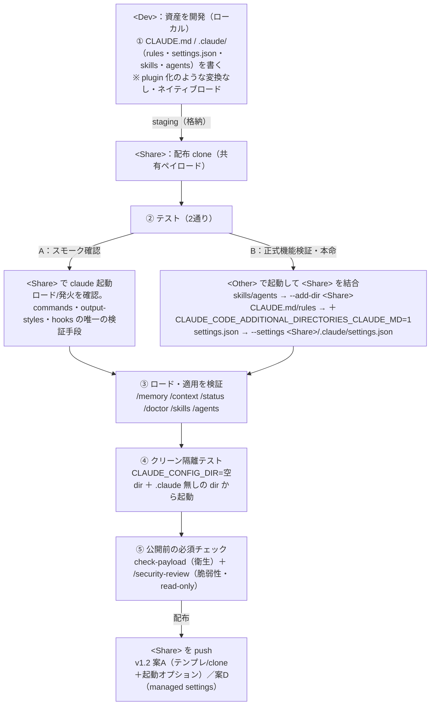

# Marketplace 外資産（CLAUDE.md / rules / settings）開発・テスト手順書（v1.0）

> - **目的**: Marketplace（層2）で配れない config 資産（`CLAUDE.md` / `.claude/rules/` / `settings.json` / skills / agents）を、config・テンプレートリポジトリで開発・テストする実務手順。全体像・結合手段・ロード検証コマンド・落とし穴を手を動かす順に把握できる。
> - **位置づけ**: [調査結果報告書](./Marketplace外資産の開発・テスト_調査結果.md) の派生（実務オペレーション版）。根拠・出典は報告書側にあり、本書は手順に絞る。第1フェーズ [Plugin 開発・テスト手順書](../01.Plugin・Marketplace編/Plugin開発・テスト_手順書.md) の config 資産版。
> - **前提環境**: Claude Code CLI。コマンドは PowerShell / bash いずれでも同形。リポジトリ記号は §0 の **`<Dev>`（資産を開発）／`<Share>`（配布 clone・共有ペイロード）／`<Other>`（日常作業リポ）** に統一する。
> - **作成日**: 2026-06-21

---

## 0. 全体像（plugin との違い）

**config 資産には plugin の `--plugin-dir` に相当する専用の開発ロード機構が無い。** ディレクトリを開けば `.claude/` から**ネイティブにロードされる**ので、開発・テストは素直:



**原則**: 専用ツールが無いぶん、**「ロードされたか・効いているか」を検証コマンド（③）で必ず確かめる**こと。「書いて起動したら効いているはず」と思い込まない。

### 推奨リポジトリ構成（`<Dev>` / `<Other>` / `<Share>`）

ローカルのリポジトリを役割で3分類すると動線が明確（仕組みは以降のまま）:

| 記号 | 役割 |
|---|---|
| `<Dev>` | 共有資産を**開発**（自由に試作） |
| `<Share>` | 公開リポの**ローカル clone** ＝共有ペイロード。`<Other>` から `--add-dir`/`--settings` で参照。公開前検証はここに資産を格納 |
| `<Other>` | 日常作業する各リポ。`<Share>` を参照し、普段の作業がそのまま公開前テストになる |

動線: **`<Dev>` で試作 → `<Share>` に格納 → `<Other>` から参照して検証 → `<Share>` を push**。

**`<Share>` の構成（共有ペイロード専用）**:

```
<Share>/
├── README.md            # <Share> 固有の運用メモ（memory ファイルでない＝自動ロードされない）
├── CLAUDE.md            # 全リポ共通ルール（= .claude/CLAUDE.md と等価）
└── .claude/
    ├── rules/*.md       # 共通規約
    ├── skills/          # --add-dir で自動ロード（env 不要）
    └── agents/          # --add-dir で自動ロード（env 不要）
    # settings.json を共有するなら <Other> 側で --settings <Share>/.claude/settings.json
```

> ⚠️ **共有境界の鉄則**: `--add-dir <Share>` ＋環境変数では `<Share>/CLAUDE.md`・`<Share>/.claude/CLAUDE.md`・`.claude/rules/*.md`・`<Share>/CLAUDE.local.md` が**まとめて**ロードされる（環境変数は all-or-nothing。**ルート/`.claude/` の置き分けでは共有可否を制御できない**）。**参照側に読ませたくないリポ固有情報は、memory ファイルでない `README.md` に置く**（自動ロードされない）。`<Share>` に個人の `CLAUDE.local.md` を残さないこと（参照側に漏れる）。

---

## 1. 開発（`<Dev>` に資産を書く）

`<Dev>` に、配る資産をそのまま置く。plugin 化のような工程は無い。固まったら `<Share>` に格納（staging）する。

```
<Dev>/
├── CLAUDE.md                 # チーム共通指示
└── .claude/
    ├── rules/*.md            # トピック規約（paths: でゲート可）
    ├── settings.json         # permissions / hooks / env / 層2起動装置(enabledPlugins等)
    ├── skills/<name>/SKILL.md
    └── agents/<name>.md
```

- skill の `SKILL.md` は編集が**即時反映**（ホットリロード）。rules は `paths:` でロード条件を制御。
- `settings.json` の `permissions` 配列はスコープ間で**結合マージ**される点、`defaultMode: auto` 等の一部 security キーは project/local では無視される点に注意（[§6 落とし穴](#pitfalls)）。

---

## 2. テスト方法A: `<Share>` でネイティブ起動（ロード/発火のスモーク確認）

最も素直な確認。`<Share>` で Claude Code を起動すれば、その `.claude/` と `CLAUDE.md` がネイティブにロードされる。開発中の手早い確認は `<Dev>` でも同じ。

```bash
cd <Share>
claude
# 起動後、§4 の検証コマンドで「何がロードされたか」を確認
```

> **位置づけ（重要）**: `<Share>` には基本的に**公開する config 資産しか無く、操作対象の実コード・ファイルが無い**。よって方法A で確認できるのは主に**「ロードされる・発火する」までのスモーク**で、ファイルを入出力する skill や rules が**"正しく働くか"までは検証できない**。**公開前の正式な機能検証は §3（方法B）が本命**。ただし `--add-dir` で結合できない `commands`/`output-styles`/`hooks` は、方法A（`<Share>` で直接起動）が唯一の検証手段。
>
> clone/テンプレ展開した直後は **trust 承認**が要る（承認まで permission や一部設定はフル有効化されない）。テストは trust 承認後に行う。

---

## 3. テスト方法B: 作業リポと結合（公開前の正式動作検証の本命）

別の作業リポ `<Other>` で起動しつつ `<Share>` の資産を結合し、**実際のコード・ファイルに対して資産を働かせて検証する**。`<Share>` 単体（方法A）では操作対象が無いため、**機能の正式検証はこちらが本命**。**手段は資産で割れる**。

```bash
# skills / subagents を結合（自動ロード・skill は live reload）
claude --add-dir <Share>

# CLAUDE.md / rules も結合（環境変数が必須）
CLAUDE_CODE_ADDITIONAL_DIRECTORIES_CLAUDE_MD=1 claude --add-dir <Share>
#   PowerShell: $env:CLAUDE_CODE_ADDITIONAL_DIRECTORIES_CLAUDE_MD=1; claude --add-dir <Share>

# settings.json（permissions/hooks 等）を結合（--add-dir では読まれない）
claude --settings <Share>/.claude/settings.json
```

結合手段の早見:

| 資産 | 結合手段 |
|---|---|
| `skills/` | `--add-dir <Share>`（live reload） |
| `agents/`（subagents） | `--add-dir <Share>` |
| `settings.json` の `enabledPlugins` / `extraKnownMarketplaces` | `--add-dir <Share>`（この2キーのみ） |
| `CLAUDE.md` / `rules/` / `CLAUDE.local.md` | `--add-dir <Share>` ＋ `CLAUDE_CODE_ADDITIONAL_DIRECTORIES_CLAUDE_MD=1` |
| `settings.json`（permissions / hooks / env 等） | `--settings <Share>/.claude/settings.json` |
| `commands/` / `output-styles/` / `hooks` | **結合不可** → `<Share>` で直接起動（方法A）か物理配置 |

> **【挙動・仕様】**
> - 環境変数 ON 時に `--add-dir <Share>` がロードする memory ファイルは `<Share>/CLAUDE.md`・`<Share>/.claude/CLAUDE.md`・`<Share>/.claude/rules/*.md`・`<Share>/CLAUDE.local.md`（**all-or-nothing**。ルート/`.claude/` での個別制御は不可）。
> - `--settings` はスコープ優先で **managed > `--settings` > local > project > user**。値はマージ、permission は deny 最優先。
>
> **【注意（落とし穴）】**
> - `--add-dir <Share>` に渡すのは「`.claude/` を内包する親フォルダ」。フォルダ名自体を `.claude` にすると `<Share>/.claude/.claude/` を探して読まれない。
> - `permissions.additionalDirectories` **設定値**経由では skills すら自動ロードされない（自動ロードは `--add-dir` フラグ／`/add-dir` 限定）。
> - 参照側に読ませたくない memory は `README.md` 等の**非 memory ファイル**へ（ルート/`.claude/` の置き分けでは共有可否を制御できない）。
>
> **【禁止・非推奨】**
> - **`settings.local.json` は共有用途に使わない**（project 個人・gitignore 専用で `--add-dir` でも読まれない）。**共有したい設定は `settings.json`**。`settings` の使い分け: 共有＝`<Share>/.claude/settings.json`（`--settings`）／マシン全リポの個人既定＝`~/.claude/settings.json`（user スコープ）／特定リポの個人 override＝`<project>/.claude/settings.local.json`。

---

## 4. ロード・適用の検証コマンド早見

書いた資産が**実際にロード・適用されたか**を確認する（plugin の `validate`/`--debug` に相当）。

| コマンド | 確認できること |
|---|---|
| **`/memory`** | ロード済みの `CLAUDE.md` / `CLAUDE.local.md` / rules ファイル一覧＋auto memory |
| **`/context`** | コンテキスト内訳（system prompt・memory・skills・MCP・会話）。**CLAUDE.md/rules/skill が"そもそも入っているか"を最初に確認** |
| **`/status`** | `Setting sources` 行＝ロード済み settings レイヤ（managed は配信チャネルを括弧表示）。設定ファイルのエラーも報告 |
| **`/doctor`**（`claude doctor`） | 設定ファイルを**バリデーション**（無効キー・schema エラー）。`f` で Claude に修正させる |
| **`/skills`** | skill 一覧（project/user/plugin・`user-only` バッジ） |
| **`/agents`** | subagent 一覧 |

> **より厳密に追うなら hook**: `InstructionsLoaded` hook で「どの指示ファイルが・いつ・なぜロードされたか」をログ（path-specific rules・サブディレクトリ遅延ロード `CLAUDE.md` のデバッグ向け）。`ConfigChange` hook は settings 再読込で発火。
>
> **限界**: `/memory` はスコープ"ラベル"を明示しない（パスから判断）。`/status` は"どのレイヤが読まれたか"は出すが"個別キーの出所"は出さない。

---

## 5. クリーン隔離テスト（個人設定・他リポ設定を切る）

テスト中に**自分や他リポの設定が混ざって"誤って動いて見える"**事故を防ぐ。混入源は2つ:

- **`~/.claude`（個人設定）** … どのテストでも乗る。
- **`<Other>/.claude`（作業リポ自身の設定）** … 方法B（`<Other>` で起動して `<Share>` を結合）の時に乗る。`<Other>` 自身の `CLAUDE.md`/rules/skills/agents が `<Share>` の資産と混ざる。

> ⚠️ **同名衝突は自動検知されない**: 同一スコープ内に同名の subagent/skill があっても、Claude Code は**警告なく片方を残して他方を破棄**する（ロードエラーやプロンプトは出ない）。よって「混ざっていないか」は**プロンプト任せにできず、`/memory`・`/skills`・`/agents`・`/context` で"何がどのパスから読まれたか"を目視確認**する（§4）。

### 隔離手順（`<Share>` の資産だけを効かせる）

空の `CLAUDE_CONFIG_DIR` が `~/.claude` を、`.claude` を持たない空作業ディレクトリが `<Other>` 設定を、それぞれ排除する。残るのは `<Share>`（と managed）だけ。**手動とスクリプトのどちらでもよい**:

```bash
# 手動（bash）
cd /tmp && CLAUDE_CONFIG_DIR=/tmp/claude-clean \
  CLAUDE_CODE_ADDITIONAL_DIRECTORIES_CLAUDE_MD=1 \
  claude --add-dir <Share> --settings <Share>/.claude/settings.json
```

```bash
# スクリプト（bash）: 一時の空 config + 空作業dir を作り <Share> を結合して起動
./scripts/clean-test-env.sh <Share>
# 引数なしなら素のクリーンセッション（切り分けの起点）
```

```powershell
# スクリプト（PowerShell）
.\scripts\clean-test-env.ps1 -Share <Share>
```

- **切り分け（二分探索）**: クリーンで問題が消えるなら原因は実 `~/.claude` か `<Other>` 側。ファイルを1つずつ戻して特定する。
- **注意**: (1) **managed settings はクリーンセッションでも適用され続ける**（system パス）。(2) Linux/Windows は**再ログイン**が要る。(3) macOS は Keychain 継承。

---

<a id="pitfalls"></a>

## 6. 公開前の必須コマンドと落とし穴チェックリスト

### 6.1 公開前に必ず実行する2コマンド（衛生 ＋ 脆弱性）

`<Share>` を公開（push）する前に、**衛生**と**脆弱性**の両方を必ず通す。役割が別なので**両方とも必須**——`/security-review` は read-only で空振りでも弊害が無いため、「コードが無いから省く」判断をせず**常に実行**して実行漏れを防ぐ。

**(1) `check-payload`（衛生・シェル/CI）** — 個人ファイル混入・無視されるキー・JSON 不正が無いか:

```bash
./scripts/check-payload.sh <Share>          # bash（FAIL で exit 1・CI 可）
```

```powershell
.\scripts\check-payload.ps1 -Share <Share>  # PowerShell
```

**(2) `/security-review`（脆弱性・Claude セッション内）** — 同梱スクリプト・hooks 等のコード脆弱性を読み取り専用でレビュー。`<Share>` を更新するブランチで:

```text
（<Share> を含むリポ/ブランチで Claude Code を開き）  /security-review
```

- **read-only・空振り無害**: コードを含まない資産に走らせても findings ゼロで終わるだけ（破壊的変更なし／コストは小さなトークン・時間のみ）。
- **check-payload と補完関係**（衛生 vs 脆弱性）。両者＋人手レビューで多層化。
- 注: `check-payload` はシェル/CI で回せるが、`/security-review` は**セッション内スラッシュコマンド**。CI で脆弱性側も自動化するなら headless 実行や専用の security-review 手段を別途用意する。

### 6.2 落とし穴チェックリスト

「commit したのに効かない」を生む仕様。テスト前に確認する。先頭の **🛠 はスクリプト（check-payload）で自動判定できる項目／🧑 は人手で確認する項目**。

- [ ] 🧑 **trust 承認後**にテストしているか（clone/テンプレ展開直後は未承認でフル有効化されない。`autoMemoryDirectory`・`extraKnownMarketplaces` の install prompt は trust 後）
- [ ] 🛠 **project/local では無視される security キー**を repo に書いていないか（効かない・スクリプトは WARN で検出）:
  - `defaultMode: "auto"`（project/local で無視・v2.1.142+。効かせるなら `~/.claude/settings.json`）
  - `skipDangerousModePermissionPrompt`（project で無視）
  - `autoMode` / `useAutoModeDuringPlan`（shared project settings から読まれない）
- [ ] 🧑 `commands` / `output-styles` / `hooks` / `settings.json` の大半を **`--add-dir` で結合したつもりになっていないか**（読まれない。直接起動か物理配置で）
- [ ] 🧑 `--add-dir` に渡すのは `.claude/` の**親**フォルダか（フォルダ名を `.claude` にしない）
- [ ] 🛠 参照元（`<Share>` 等）に**個人の `CLAUDE.local.md` が残っていないか**（環境変数 ON 時に参照側へ漏れる）
- [ ] 🧑 参照側に読ませたくないリポ固有情報を、`CLAUDE.md`/`.claude/CLAUDE.md` でなく **`README.md`（非ロード）に置いた**か（ルート/`.claude/` の置き分けでは共有可否を制御できない）
- [ ] 🛠 `<Share>` に **`settings.local.json` を置いていないか**（project 個人・非共有＝`CLAUDE.local.md` と同じ。共有したい設定は `settings.json` に置き `--settings` で渡す）
- [ ] 🛠 `settings.json` が **valid JSON** か（不正だと `/doctor` でも検出される）
- [ ] 🧑 反映タイミングを踏まえているか（settings 即時／`model`・`outputStyle`・**環境変数は再起動側**／skills ホットリロード）
- [ ] 🧑 `/doctor` が schema エラーを出していないか、`/memory`・`/status` で**意図したファイル・レイヤが実際にロードされているか**を確認したか

---

## 7. （注記）層3 managed settings の検証

managed settings で配る場合の確認（詳細は v1.2 案D・本タスクのスコープ外）:

- **`/status`** の `Setting sources` に `Enterprise managed settings (remote)`/`(plist)`/`(HKLM)`/`(HKCU)`/`(file)` と出て**配信方式を確認**できる。
- managed は `CLAUDE_CONFIG_DIR` のクリーンセッションでも**残る**（system パス）。
- server-managed は shell/env/hook 設定で**承認ダイアログ**が出る（拒否で終了。`-p` 非対話はスキップして自動適用）。
- auto mode ルールは `claude auto-mode config` / `defaults` / `critique` で確認。

---

## 変更履歴

- **v1.0（2026-06-21）**: 初版。[調査結果報告書 v1.0](./Marketplace外資産の開発・テスト_調査結果.md) を実務手順に落とし込み（ネイティブ起動・結合3経路・検証コマンド・クリーン隔離・落とし穴・層3 注記）。レビュー反映として §0 に推奨リポジトリ構成（`<Dev>`/`<Other>`/`<Share>`・案1 共有ペイロード＋README 隔離・共有境界の鉄則）、§3 に `--add-dir` の正確な memory ロード範囲、§6 に `CLAUDE.local.md` 漏れ・共有境界の落とし穴を追加。`settings.local.json` 非共有（共有は `settings.json`・マシン全リポの個人既定は `~/.claude/settings.json`）を §3・§6 に追記。本文の用語を §0 図の **`<Dev>`/`<Other>`/`<Share>`** に統一（「config リポ」「`<D>`」「`<W>`」を一掃）。クリーン隔離テスト環境作成スクリプトと落とし穴機械チェックスクリプト（bash/PowerShell 各2本）を `scripts/` に追加し §5・§6 から参照。レビュー反映: §2 を「ロード/発火スモーク」と位置づけ §3（方法B）を**正式機能検証の本命**に再フレーム、§3 の引用を【挙動・仕様】【注意】【禁止・非推奨】に再分類、§5 に `<Other>/.claude` 混入と同名衝突の非検知（`/memory` 等で目視）を追記しスクリプト実行例を手動と同格に併記・「バイセクト」→「二分探索」、§6 チェックリスト各項目に 🛠（スクリプト自動）/🧑（人手）を付与しスクリプト実行例を格上げ。§0 の全体像図を ASCII から **mermaid（GitHub ネイティブ描画）** に変更。§6 に「公開前の必須2コマンド」（`check-payload`＝衛生／`/security-review`＝脆弱性・read-only で空振り無害ゆえ常時実行）を新設し、mermaid に公開前ゲート（⑤）ノードを追加。
