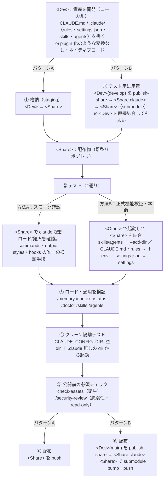

# Marketplace 外資産（CLAUDE.md / rules / settings）開発・テスト手順書（v1.7）

> - **目的**: Marketplace（層2）で配れない config 資産（`CLAUDE.md` / `.claude/rules/` / `settings.json` / skills / agents）を、config・テンプレートリポジトリで開発・テストする実務手順。全体像・結合手段・ロード検証コマンド・落とし穴を手を動かす順に把握できる。
> - **位置づけ**: [調査結果報告書](./Marketplace外資産の開発・テスト_調査結果.md) の派生（実務オペレーション版）。根拠・出典は報告書側にあり、本書は手順に絞る。第1フェーズ [Plugin 開発・テスト手順書](../01.Plugin・Marketplace編/Plugin開発・テスト_手順書.md) の config 資産版。
> - **前提環境**: Claude Code CLI。コマンドは PowerShell / bash いずれでも同形。リポジトリ記号は §0 の **`<Dev>`（資産を開発）／`<Share>`（配布物＝雛型リポジトリ）／`<Share.claude>`（パターンB のみ・`.claude` 本体の独立リポ）／`<Other>`（日常作業リポ）** に統一する。
> - **作成日**: 2026-06-21

---

## 0. 全体像（plugin との違い）

**config 資産には plugin の `--plugin-dir` に相当する専用の開発ロード機構が無い。** ディレクトリを開けば `.claude/` から**ネイティブにロードされる**ので、開発・テストは素直:



**原則**: 専用ツールが無いぶん、**「ロードされたか・効いているか」を検証コマンド（③）で必ず確かめる**こと。「書いて起動したら効いているはず」と思い込まない。

### トポロジの選択（パターンA / パターンB）

開発ローカルの構成は 2 パターンある。**テスト・検証手順（§1〜§6）は両パターン共通**で、違うのは**トポロジと配布・同期運用（§7）**だけ。上図でも ②〜⑤ は両パターン共通で、**① 格納／publish と ⑥ 配布だけがパターン依存**（パターンA=staging/push ／ パターンB=publish→submodule bump・§7.2）。

> **用語の別軸に注意**: 図中の **「方法A／方法B」はテスト手段**（§2 ネイティブ起動／§3 結合）の区別であり、本節で導入する **「パターンA／パターンB」＝トポロジ**とは**別の軸**。両者は独立に組み合わさる（例: パターンB でも検証は方法A・方法B の両方を使う）。

| | パターンA: 単一 `<Share>` | パターンB: `.claude` を submodule 分割 |
|---|---|---|
| `<Share>` の `.claude` | 通常ディレクトリ（その repo に同梱） | 独立リポ `<Share.claude>` の **git submodule** |
| 登場リポ | `<Dev>` / `<Share>` / `<Other>` | `<Dev>` / **`<Share.claude>`** / `<Share>`（雛型リポジトリ）/ `<Other>` |
| 配布 | `<Share>` を clone＋起動オプション参照／push | `<Dev>`→`<Share.claude>` を publish→`<Share>` が submodule bump。`<Share>` はコピー展開できる雛型 |
| 向くケース | 単一の共有設定を 1 リポで回す | `.claude` を branch 非依存の独立資産として複数プロジェクトで共有・雛型化したい |
| 詳細 | §7.1 | §7.2 |

> 以降 **§1〜§6 は両パターン共通**。配布・同期運用だけ **§7** でパターン別に分かれる。`<Share>` の構成・共有境界の鉄則（直下）は両パターンに共通して適用される（パターンB では `<Share>/.claude` がそのまま submodule になる）。

### パターンA の構成（単一 `<Share>`・`<Dev>` / `<Other>` / `<Share>`）

ローカルのリポジトリを役割で3分類すると動線が明確（仕組みは以降のまま）:

| 記号 | 役割 |
|---|---|
| `<Dev>` | 共有資産を**開発**（自由に試作） |
| `<Share>` | 公開リポの**ローカル clone** ＝共有ペイロード。`<Other>` から `--add-dir`/`--settings` で参照。公開前検証はここに資産を格納 |
| `<Other>` | 日常作業する各リポ。`<Share>` を参照し、普段の作業がそのまま公開前テストになる |

動線: **`<Dev>` で試作 → `<Share>` に格納 → `<Other>` から参照して検証 → `<Share>` を push**。

**`<Share>` の構成（共有ペイロード専用）**:

```
<Share>/
├── README.md            # <Share> 固有の運用メモ（memory ファイルでない＝自動ロードされない）
├── CLAUDE.md            # 全リポ共通ルール（= .claude/CLAUDE.md と等価）
└── .claude/
    ├── rules/*.md       # 共通規約
    ├── skills/          # --add-dir で自動ロード（env 不要）
    └── agents/          # --add-dir で自動ロード（env 不要）
    # settings.json を共有するなら <Other> 側で --settings <Share>/.claude/settings.json
```

> ⚠️ **共有境界の鉄則**: `--add-dir <Share>` ＋環境変数では `<Share>/CLAUDE.md`・`<Share>/.claude/CLAUDE.md`・`.claude/rules/*.md`・`<Share>/CLAUDE.local.md` が**まとめて**ロードされる（環境変数は all-or-nothing。**ルート/`.claude/` の置き分けでは共有可否を制御できない**）。**参照側に読ませたくないリポ固有情報は、memory ファイルでない `README.md` に置く**（自動ロードされない）。`<Share>` に個人の `CLAUDE.local.md` を残さないこと（参照側に漏れる）。

---

## 1. 開発（`<Dev>` に資産を書く）

`<Dev>` に、配る資産をそのまま置く。plugin 化のような工程は無い。固まったら `<Share>` に格納（staging）する。

```
<Dev>/
├── CLAUDE.md                 # チーム共通指示
└── .claude/
    ├── rules/*.md            # トピック規約（paths: でゲート可）
    ├── settings.json         # permissions / hooks / env / 層2起動装置(enabledPlugins等)
    ├── skills/<name>/SKILL.md
    └── agents/<name>.md
```

- skill の `SKILL.md` は編集が**即時反映**（ホットリロード）。rules は `paths:` でロード条件を制御。
- `settings.json` の `permissions` 配列はスコープ間で**結合マージ**される点、`defaultMode: auto` 等の一部 security キーは project/local では無視される点に注意（[§6 落とし穴](#pitfalls)）。

---

## 2. テスト方法A: `<Share>` でネイティブ起動（ロード/発火のスモーク確認）

最も素直な確認。`<Share>` で Claude Code を起動すれば、その `.claude/` と `CLAUDE.md` がネイティブにロードされる。開発中の手早い確認は `<Dev>` でも同じ。

```bash
cd <Share>
claude
# 起動後、§4 の検証コマンドで「何がロードされたか」を確認
```

> **位置づけ（重要）**: `<Share>` には基本的に**公開する config 資産しか無く、操作対象の実コード・ファイルが無い**。よって方法A で確認できるのは主に**「ロードされる・発火する」までのスモーク**で、ファイルを入出力する skill や rules が**"正しく働くか"までは検証できない**。**公開前の正式な機能検証は §3（方法B）が本命**。ただし `--add-dir` で結合できない `commands`/`output-styles`/`hooks` は、方法A（`<Share>` で直接起動）が唯一の検証手段。
>
> clone/テンプレ展開した直後は **trust 承認**が要る（承認まで permission や一部設定はフル有効化されない）。テストは trust 承認後に行う。

---

## 3. テスト方法B: 作業リポと結合（公開前の正式動作検証の本命）

別の作業リポ `<Other>` で起動しつつ `<Share>` の資産を結合し、**実際のコード・ファイルに対して資産を働かせて検証する**。`<Share>` 単体（方法A）では操作対象が無いため、**機能の正式検証はこちらが本命**。**手段は資産で割れる**。

```bash
# skills / subagents を結合（自動ロード・skill は live reload）
claude --add-dir <Share>

# CLAUDE.md / rules も結合（環境変数が必須）
CLAUDE_CODE_ADDITIONAL_DIRECTORIES_CLAUDE_MD=1 claude --add-dir <Share>
#   PowerShell: $env:CLAUDE_CODE_ADDITIONAL_DIRECTORIES_CLAUDE_MD=1; claude --add-dir <Share>

# settings.json（permissions/hooks 等）を結合（--add-dir では読まれない）
claude --settings <Share>/.claude/settings.json
```

結合手段の早見:

| 資産 | 結合手段 |
|---|---|
| `skills/` | `--add-dir <Share>`（live reload） |
| `agents/`（subagents） | `--add-dir <Share>`（**v2.1.178+**・v2.1.165 までは不可） |
| `settings.json` / `settings.local.json` の `enabledPlugins` / `extraKnownMarketplaces` | `--add-dir <Share>`（この2キーのみ） |
| `CLAUDE.md` / `rules/` / `CLAUDE.local.md` | `--add-dir <Share>` ＋ `CLAUDE_CODE_ADDITIONAL_DIRECTORIES_CLAUDE_MD=1` |
| `settings.json`（permissions / hooks / env 等） | `--settings <Share>/.claude/settings.json` |
| `commands/` / `output-styles/` / `hooks` | **結合不可** → `<Share>` で直接起動（方法A）か物理配置 |

> **正本**: 版依存の事実（subagents の版境界・`settings.local.json` を含む2キー例外）は [v1.2 付録B『`--add-dir` 例外ロード一覧（正本）』](../../01.配布・統制方針調査/結論・構成案_ポータブルな.claude共有_v1.2.md#adddir-exceptions) を正とする（本表は運用早見）。

> **【挙動・仕様】**
> - 環境変数 ON 時に `--add-dir <Share>` がロードする memory ファイルは `<Share>/CLAUDE.md`・`<Share>/.claude/CLAUDE.md`・`<Share>/.claude/rules/*.md`・`<Share>/CLAUDE.local.md`（**all-or-nothing**。ルート/`.claude/` での個別制御は不可）。
> - `--settings` はスコープ優先で **managed > `--settings` > local > project > user**。値はマージ、permission は deny 最優先。
>
> **【注意（落とし穴）】**
> - `--add-dir <Share>` に渡すのは「`.claude/` を内包する親フォルダ」。フォルダ名自体を `.claude` にすると `<Share>/.claude/.claude/` を探して読まれない。
> - `permissions.additionalDirectories` **設定値**経由では skills すら自動ロードされない（自動ロードは `--add-dir` フラグ／`/add-dir` 限定）。
> - 参照側に読ませたくない memory は `README.md` 等の**非 memory ファイル**へ（ルート/`.claude/` の置き分けでは共有可否を制御できない）。
>
> **【禁止・非推奨】**
> - **`settings.local.json` は共有用途に使わない**（project 個人・gitignore 専用。例外として `enabledPlugins` / `extraKnownMarketplaces` の2キーは `settings.json` 同様 `--add-dir` で読まれるが、それ以外のキーは読まれない）。**共有したい設定は `settings.json`**。`settings` の使い分け: 共有＝`<Share>/.claude/settings.json`（`--settings`）／マシン全リポの個人既定＝`~/.claude/settings.json`（user スコープ）／特定リポの個人 override＝`<project>/.claude/settings.local.json`。

---

## 4. ロード・適用の検証コマンド早見

書いた資産が**実際にロード・適用されたか**を確認する（plugin の `validate`/`--debug` に相当）。

| コマンド | 確認できること |
|---|---|
| **`/memory`** | ロード済みの `CLAUDE.md` / `CLAUDE.local.md` / rules ファイル一覧＋auto memory |
| **`/context`** | コンテキスト内訳（system prompt・memory・skills・MCP・会話）。**CLAUDE.md/rules/skill が"そもそも入っているか"を最初に確認** |
| **`/status`** | `Setting sources` 行＝ロード済み settings レイヤ（managed は配信チャネルを括弧表示）。設定ファイルのエラーも報告 |
| **`/doctor`**（`claude doctor`） | 設定ファイルを**バリデーション**（無効キー・schema エラー）。`f` で Claude に修正させる |
| **`/skills`** | skill 一覧（project/user/plugin・`user-only` バッジ） |
| **`/agents`** | subagent 一覧 |

> **より厳密に追うなら hook**: `InstructionsLoaded` hook で「どの指示ファイルが・いつ・なぜロードされたか」をログ（path-specific rules・サブディレクトリ遅延ロード `CLAUDE.md` のデバッグ向け）。`ConfigChange` hook は settings 再読込で発火。
>
> **限界**: `/memory` はスコープ"ラベル"を明示しない（パスから判断）。`/status` は"どのレイヤが読まれたか"は出すが"個別キーの出所"は出さない。

---

## 5. クリーン隔離テスト（個人設定・他リポ設定を切る）

テスト中に**自分や他リポの設定が混ざって"誤って動いて見える"**事故を防ぐ。混入源は2つ:

- **`~/.claude`（個人設定）** … どのテストでも乗る。
- **`<Other>/.claude`（作業リポ自身の設定）** … 方法B（`<Other>` で起動して `<Share>` を結合）の時に乗る。`<Other>` 自身の `CLAUDE.md`/rules/skills/agents が `<Share>` の資産と混ざる。

> ⚠️ **同名衝突は自動検知されない**: 同一スコープ内に同名の subagent/skill があっても、Claude Code は**警告なく片方を残して他方を破棄**する（ロードエラーやプロンプトは出ない）。よって「混ざっていないか」は**プロンプト任せにできず、`/memory`・`/skills`・`/agents`・`/context` で"何がどのパスから読まれたか"を目視確認**する（§4）。

### 隔離手順（`<Share>` の資産だけを効かせる）

空の `CLAUDE_CONFIG_DIR` が `~/.claude` を、`.claude` を持たない空作業ディレクトリが `<Other>` 設定を、それぞれ排除する。残るのは `<Share>`（と managed）だけ。**手動とスクリプトのどちらでもよい**:

```bash
# 手動（bash）
cd /tmp && CLAUDE_CONFIG_DIR=/tmp/claude-clean \
  CLAUDE_CODE_ADDITIONAL_DIRECTORIES_CLAUDE_MD=1 \
  claude --add-dir <Share> --settings <Share>/.claude/settings.json
```

```bash
# スクリプト（bash）: 一時の空 config + 空作業dir を作り <Share> を結合して起動
./scripts/clean-test-env.sh <Share>
# 引数なしなら素のクリーンセッション（切り分けの起点）
```

```powershell
# スクリプト（PowerShell）
.\scripts\clean-test-env.ps1 -Share <Share>
```

- **切り分け（二分探索）**: クリーンで問題が消えるなら原因は実 `~/.claude` か `<Other>` 側。ファイルを1つずつ戻して特定する。
- **注意**: (1) **managed settings はクリーンセッションでも適用され続ける**（system パス）。(2) Linux/Windows は**再ログイン**が要る。(3) macOS は Keychain 継承。
- **🔎 実機観測（item3 C7・2026-06-22）**: `claude -p "…" --debug-file <log>` でクリーン起動すると、debug ログの `Watching for changes in setting files …` に**空 `CLAUDE_CONFIG_DIR` の `settings.json` だけ**が出る（個人 `~/.claude`・project・local は消える）＝隔離成立を実証。`C:\Program Files\ClaudeCode\managed-settings.json` の探索行は残る（managed 残存）。空 config には auth が乗らず `Not logged in · Please run /login` となり、(2) の再ログインが必要なことも裏取りできた。**`--debug-file` の設定ロードログは `/status` を補完する非対話の権威ある証跡**（LLM 自己申告と違い実ロードの記録）として使える。⚠ debug ログには `localSettings` 等の個人ルールが平文で出るため、検証後は削除する。

---

<a id="pitfalls"></a>

## 6. 公開前の必須コマンドと落とし穴チェックリスト

### 6.1 公開前に必ず実行する2コマンド（衛生 ＋ 脆弱性）

`<Share>` を公開（push）する前に、**衛生**と**脆弱性**の両方を必ず通す。役割が別なので**両方とも必須**——`/security-review` は read-only で空振りでも弊害が無いため、「コードが無いから省く」判断をせず**常に実行**して実行漏れを防ぐ。

**(1) `check-assets`（衛生・シェル/CI）** — 個人ファイル混入・無視されるキー・JSON 不正が無いか:

```bash
./scripts/check-assets.sh <Share>          # bash（FAIL で exit 1・CI 可）
```

```powershell
.\scripts\check-assets.ps1 -Share <Share>  # PowerShell
```

**(2) `/security-review`（脆弱性・Claude セッション内）** — 同梱スクリプト・hooks 等のコード脆弱性を読み取り専用でレビュー。`<Share>` を更新するブランチで:

```text
（<Share> を含むリポ/ブランチで Claude Code を開き）  /security-review
```

- **read-only・空振り無害**: コードを含まない資産に走らせても findings ゼロで終わるだけ（破壊的変更なし／コストは小さなトークン・時間のみ）。
- **check-assets と補完関係**（衛生 vs 脆弱性）。両者＋人手レビューで多層化。
- 注: `check-assets` はシェル/CI で回せるが、`/security-review` は**セッション内スラッシュコマンド**。CI で脆弱性側も自動化するなら headless 実行や専用の security-review 手段を別途用意する。

### 6.2 落とし穴チェックリスト

「commit したのに効かない」を生む仕様。テスト前に確認する。**🛠（スクリプト `check-assets` で自動判定できる項目）を上に、🧑（人手で目視確認する項目）を下にまとめた**。個人ファイル系の 🛠 は、`<Share>` が git リポジトリなら **Git 追跡されているか**で判定する（**追跡＝FAIL**＝clone に含まれ漏れる／**未追跡で実在＝WARN**＝gitignore 済みで配布はされないが掃除推奨／不在＝PASS）。非 git の素ディレクトリでは実在＝FAIL にフォールバックする。

#### パターンA/B 共通

**両パターンとも必須**（パターンB でも下記はすべて確認する。次の「パターンB 固有」は本リストへの**上乗せ**であり、置き換えではない）。

**🛠 スクリプト自動判定**

- [ ] 🛠 **project/local では無視される security キー**を repo に書いていないか（効かない・スクリプトは WARN で検出）:
  - `defaultMode: "auto"`（project/local で無視・v2.1.142+。**付与できるのは policy(managed)/user(`~/.claude`)/flag(`--settings`)** スコープのみ）
  - `skipDangerousModePermissionPrompt`（project で無視）
  - `autoMode` / `useAutoModeDuringPlan`（shared project settings から読まれない）
  - **🔎 実機観測（item3 C12・2026-06-22）**: project に `defaultMode:"auto"` を置き `--debug-file` 起動すると `[WARN] settings defaultMode "auto" ignored — only policy/user/flag settings may grant auto mode (projectSettings and localSettings are repo-controllable)` が出力され、無視を実機で確認。`--settings`（flag 層）でも付与可能な点は従来記載（「`~/.claude` のみ」）の精密化。
- [ ] 🛠 参照元（`<Share>` 等）に**個人の `CLAUDE.local.md` が残っていないか**（環境変数 ON 時に参照側へ漏れる）
- [ ] 🛠 `<Share>` に **`settings.local.json` を置いていないか**（project 個人・非共有。例外は `enabledPlugins`/`extraKnownMarketplaces` の2キーのみ `--add-dir` で読まれる点。共有したい設定は `settings.json` に置き `--settings` で渡す）
- [ ] 🛠 `settings.json` が **valid JSON** か（不正だと `/doctor` でも検出される）
- [ ] 🛠 **ランチャーの個人実体**（`.claude/custom.env` / `option-settings.sh` / `option-settings.ps1`）を追跡・混入していないか（テンプレから利用者が作る個人ファイル）
- [ ] 🛠 **内部成果物・作業一時物**（`.claude/reports` / `work` / `workspace` / `plans` / `agent-memory-local` / `work_instructions.txt` / `.bat-shadow`）を混入していないか ―― **内部レポートの公開リポ流出を止める最後の砦（CR-A 対応の中核）**
- [ ] 🛠 **配布先の統制ファイル**（`.claude/.gitignore` / `.claude/.gitattributes`）が payload に**有る**か（無いと publish のミラーで配布先の除外設定・改行保護が消える。payload では FAIL / 作業ツリーでは WARN）
- [ ] 🛠 配布物内に**環境固有の絶対パス**（`C:\…` / `/home/…` / `/Users/…`）が無いか（WARN）
- [ ] 🛠 配布される **`.ps1` がすべて UTF-8 BOM 付き**か（BOM 無しは Windows PowerShell 5.1 で CP932 誤読）
- [ ] 🛠 **`.claude/CLAUDE.md` が在る**か（案1 構成。共有共通ルールの正本。無いとルート `CLAUDE.md` に共有ルールがある疑いで FAIL）
- [ ] 🛠 ルート `CLAUDE.md` が Git 追跡されている場合の注意喚起（`--add-dir` + env で参照側にロードされる。リポ固有情報を含めない・WARN）

> 上記の 🛠 は `check-assets`（`.sh`/`.ps1`）が実際に自動判定する項目。**実装は本チェックリストより広い範囲を検査している**ため、迷ったら手動列挙よりスクリプトの出力を正とする。

**🧑 人手で目視確認**

- [ ] 🧑 **trust 承認後**にテストしているか（clone/テンプレ展開直後は未承認でフル有効化されない。`autoMemoryDirectory`・`extraKnownMarketplaces` の install prompt は trust 後）
- [ ] 🧑 `commands` / `output-styles` / `hooks` / `settings.json` の大半を **`--add-dir` で結合したつもりになっていないか**（読まれない。直接起動か物理配置で）
- [ ] 🧑 `--add-dir` に渡すのは `.claude/` の**親**フォルダか（フォルダ名を `.claude` にしない）
- [ ] 🧑 参照側に読ませたくないリポ固有情報を、`CLAUDE.md`/`.claude/CLAUDE.md` でなく **`README.md`（非ロード）に置いた**か（ルート/`.claude/` の置き分けでは共有可否を制御できない）
- [ ] 🧑 反映タイミングを踏まえているか（settings 即時／`model`・`outputStyle`・**環境変数は再起動側**／skills ホットリロード）
- [ ] 🧑 `/doctor` が schema エラーを出していないか、`/memory`・`/status` で**意図したファイル・レイヤが実際にロードされているか**を確認したか

#### パターンB（submodule 分割）固有

**§7.2 採用時に、上の「共通」へ上乗せして確認する**（共通分は省略不可）。

**🛠 スクリプト自動判定**

- [ ] 🛠 個人ファイル（`settings.local.json`/`CLAUDE.local.md`）が publish payload に混入していないか。**検査は `<Dev>` に対して `check-assets` をかける**（`publish-share` が内部で `git archive <ref> .claude` の実体を `--payload` で検査するのと同じ経路）。publish は追跡ファイルのみミラーするため未追跡なら混入しないが、誤追跡は漏れる。
  - ⚠ **`<Share.claude>` 自体に直接 `check-assets` をかけてはいけない**。`<Share.claude>` はルート直下が `.claude/` の中身（入れ子の `.claude/` が無い）なので、スクリプトが `<path>/.claude/…` を探して**実在するファイルを「無い」と誤 FAIL/WARN したり、見当違いの場所を見て偽 PASS を返したりする**（実機確認済み：`CLAUDE.md`/`settings.json`/`.gitignore`/`.gitattributes` が実在するのに `.claude/CLAUDE.md が無い` で FAIL）。個人ファイル追跡の検出は `<Dev>` の payload 経路で担保される。

**🧑 人手で目視確認**

- [ ] 🧑 `<Share>` の submodule（`.claude`）を**初期化したか**（`git submodule update --init`）。未初期化だと `.claude` が空で、`--add-dir <Share>` しても**エラーなく何も載らない**（`/skills`・`/memory` で要確認）
- [ ] 🧑 root `CLAUDE.md` と `<Share.claude>` 側の `.claude/CLAUDE.md` を**二重に書いていないか**（環境変数 ON 時に両方ロードされ重複管理になる。共通ルールはどちらか一方＝通常 `.claude/CLAUDE.md` に寄せる）
- [ ] 🧑 `.gitmodules` の `branch` が公開基準（`main`）に設定されているか（`submodule update --remote` の追従先）

---

## 7. 配布・同期運用【パターン分岐】

§0 で選んだトポロジに応じて、資産を `<Share>` へ届け（**配布**）、利用側を最新化（**同期**）する運用が分かれる。テスト・検証（§1〜§6）は共通。

### 7.1 パターンA: 単一 `<Share>`

- **配布**: `<Dev>` で固めた資産を `<Share>` に格納（staging）し、`<Share>` を push する（`<Share>` 自体が公開リポ）。
- **参照（`<Other>`）**: `claude --add-dir <Share>`（＋ §3 の env / `--settings`）。`<Other>` での日常作業がそのまま公開前テストになる。
- **最新化**: `<Other>` 側は `git -C <Share> pull --ff-only` で `<Share>` を更新（**取得のみ・push を伴わない**。日次の作業開始時にランチャーで自動化してよい）。

### 7.2 パターンB: `.claude` を submodule 分割（`<Share.claude>`）

`.claude` を独立リポ `<Share.claude>` に切り出し、配布物 `<Share>`（雛型リポジトリ）がそれを `.claude` submodule として取り込む。`<Share.claude>` が「配る `.claude` の単一の真実源」になる。

#### トポロジ


| 記号 | 役割 |
|---|---|
| `<Dev>` | 資産を開発 |
| `<Share.claude>` | `.claude` 本体の独立リポ。submodule 元・公開の単一真実源 |
| `<Share>` | `<Share.claude>` を `.claude` submodule として取り込む**雛型(配布)リポジトリ**。`--add-dir` で参照、または直下をコピー展開して使う配布物そのもの |
| `<Other>` | 日常作業リポ。`<Share>` を参照 |

#### ブランチ方針（`<Dev>`）

- **develop** = クリーン隔離テスト（§5）の基準。
- **main**（GitHub default）= 公開基準。publish は main に取り込んだ状態を対象にする。
- `<Share>` の `.gitmodules` に `branch = main` を設定し、submodule の追従先を公開基準に固定する。

#### 配布（Sync A・publish・手動ゲート）

`<Dev>` の `.claude`（追跡ファイルのみ）を `<Share.claude>` へ反映する**意図的な公開操作**。`scripts/publish-share` を使う:

```bash
# bash
./scripts/publish-share.sh  --ref <ref> [--share <Share.claude のパス>]
# PowerShell
.\scripts\publish-share.ps1 -Ref <ref> [-ShareBody <Share.claude のパス>]
# 例: リリースタグを publish
./scripts/publish-share.sh --ref v1.0.1 --share /path/to/<Share.claude>
```

- **`--ref` は必須（既定値なし）**。かつて既定は `main` だったが、未 grooming の ref を無自覚に publish して内部レポートを公開リポへ流出させる事故（CR-A）を招いたため廃止した。省略すると `‼ --ref は必須です` で `exit 2`。一方 **`--share`/`-ShareBody` は既定値あり（省略可）**。`git archive <ref> .claude` で取り出すため **checkout 不要**で任意 ref を publish できる。
- **公開前ゲートを内蔵**: `check-assets`（§6.1・**取り出した実体**を `--payload` で検査）→ `/security-review` の手動確認 → 追跡ファイルのみミラー → `<Share.claude>` を commit/push。
  - ⚠ パターンB の `/security-review` は **`<Dev>` の publish 対象 ref（`--ref` に渡す ref）に対して実行する**。publish 時点では `<Share.claude>` にまだその内容が反映されていないため（§6.1 の「`<Share>` を含むリポで開き」は主にパターンA 向けの表現）。`publish-share` は「その ref で `/security-review` 実行済みか」を対話で確認するだけで、レビュー自体は代行しない。
- **安全弁**: 取り出した `.claude` が空なら中止（`<Share.claude>` を空で上書きしない）。
- **自動化しない**（session 開始 hook 等に載せない）。公開前ゲートを素通りさせないため、意図的な手動実行に限る。
- publish 後、`<Share>` で submodule を bump:

```bash
git -C <Share> submodule update --remote .claude
git -C <Share> add .claude && git -C <Share> commit -m "chore: bump .claude" && git -C <Share> push
```

#### 最新化（Sync B・refresh・自動可）

利用側（`<Share>`、および `<Share>` を参照/コピーした `<Other>`）で**最新の共有 `.claude` を取得のみ**する。**push を伴わない**ので、日次の作業開始時にランチャーで自動実行してよい:

```bash
git -C <Share> pull --ff-only
git -C <Share> submodule update --init --remote   # .claude を最新へ（init も兼ねる）
```

- ランチャー連携は**消費側（`<Share>`/`<Other>`）のみ**。供給元 `<Dev>` には入れない（逆流防止）。
- publish（Sync A）とは別物。**refresh は決して push しない／publish はランチャー・hook に載せない**。

#### 雛型としてのコピー利用

`<Share>` 直下（`.claude` の中身＋`README.md`＋`*.sample`）を既存プロジェクトへ**コピー**して即 Claude Code 化する（`.git`/`.gitmodules` は持ち込まない＝中身だけをコピー）。`CLAUDE.md` はコピー先で `CLAUDE.md.sample` を改名して作成する。submodule 固有の注意は [§6.2 パターンB 固有](#pitfalls) を参照。

---

## 8. （注記）層3 managed settings の検証

managed settings で配る場合の確認（詳細は v1.2 案D・本タスクのスコープ外）:

- **`/status`** の `Setting sources` に `Enterprise managed settings (remote)`/`(plist)`/`(HKLM)`/`(HKCU)`/`(file)` と出て**配信方式を確認**できる。
- managed は `CLAUDE_CONFIG_DIR` のクリーンセッションでも**残る**（system パス）。
- server-managed は shell/env/hook 設定で**承認ダイアログ**が出る（拒否で終了。`-p` 非対話はスキップして自動適用）。
- auto mode ルールは `claude auto-mode config` / `defaults` / `critique` で確認。

---

## 変更履歴

- **v1.7（2026-07-20）**: Sonnet 動作検証（実スクリプト・実リポとの読み合わせ）で検出した文書と実装の乖離 4 件を反映。**(1) §7.2 の `publish-share` 署名を実装に合わせ訂正** ―― `--ref` は**必須**（既定 `main` は CR-A〔未 grooming ref の誤 publish で内部レポート流出〕を機に廃止済み）、`--share`/`-ShareBody` は**任意**（既定値あり）。旧版は必須/任意が逆だった。**(2) §6.2 パターンB固有の「`<Share.claude>` に直接 `check-assets`」を訂正** ―― `<Share.claude>` はルート直下が `.claude/` の中身で入れ子が無く、直接かけると実在ファイルを誤 FAIL する（実機確認）。検査は `<Dev>` の payload 経路で担保する旨に修正。**(3) §6.2 の 🛠 自動判定項目を実装に追随** ―― ランチャー個人実体・内部成果物混入（CR-A 対応の中核）・統制ファイル不在・環境固有絶対パス・`.ps1` の BOM・`.claude/CLAUDE.md` 所在・ルート `CLAUDE.md` 追跡注意の 7 項目を追記（実装は従来記載の 4 項目より広く検査していた）。**(4) §7.2 に、パターンB の `/security-review` は `<Dev>` の publish 対象 ref に対して実行する旨を補記**。あわせてタイトルの版数表記（v1.0 のまま陳腐化していた）を実体に合わせ更新。
- **v1.6（2026-06-29）**: 開発ローカルのトポロジを **パターンA（単一 `<Share>`）／パターンB（`.claude` を独立リポ `<Share.claude>` に submodule 分割）** として正式化。§0 に「トポロジの選択」（§1〜§6 は両パターン共通・配布運用のみ §7 で分岐）を追加し、旧「推奨リポジトリ構成」を「パターンA の構成」に改題。全体像図は **① 格納/publish・⑥ 配布をパターンA箱／パターンB箱に分岐**し、テスト手段「方法A/B」とトポロジ「パターンA/B」のラベル衝突も解消。§7 を「配布・同期運用【パターン分岐】」に再編（7.1 A／7.2 B: トポロジ図・ブランチ方針〔develop=テスト基準／main=公開基準〕・publish〔Sync A・`publish-share`・手動ゲート・ref 指定〕・refresh〔Sync B・取得のみ・自動可〕・雛型コピー利用）。§6.2 を **🛠（スクリプト自動）上／🧑（人手目視）下**に並べ替え、**「パターンA/B 共通」「パターンB 固有」の見出し**に再構成（共通分はパターンB でも必須＝固有は上乗せの明示）。パターンB 固有として submodule の落とし穴（未初期化空振り・二重ロード・個人ファイル誤追跡・`.gitmodules` branch）を追加。旧 §7（層3 注記）を §8 へ繰り下げ。`scripts/` に `publish-share.{sh,ps1}` の正本を追加。`<Share>` の役割名を「雛型(配布)リポジトリ」と明確化。
- **v1.5（2026-06-29）**: 横断整合性レビュー J1 反映。§3 結合早見表に版依存事実の**正本＝[v1.2 付録B『--add-dir 例外ロード一覧（正本）』](../../01.配布・統制方針調査/結論・構成案_ポータブルな.claude共有_v1.2.md#adddir-exceptions)** への参照注記を追加（本表は運用早見）。
- **v1.4（2026-06-29）**: 公式 docs 最新版（v2.1.195 相当・2026-06-28 スナップショット）への陳腐化照合を実施。`settings.local.json` も `enabledPlugins`/`extraKnownMarketplaces` の2キーに限り `settings.json` 同様 `--add-dir` で読まれる事実（docs「Additional directories」表）に合わせ、§3 結合早見表・【禁止・非推奨】注記・§6.2 チェックリストの「`settings.local.json` は `--add-dir` でも読まれない」を精密化（2キー例外を明記）。共有用途に使わない実務指針自体は不変。
- **v1.3（2026-06-22）**: item3 残検証 C7/C12 の実機観測を反映。§5 クリーン隔離に **`--debug-file` の設定ロードログによる隔離成立の実証**（watch=空 config のみ・managed 残存・auth 非継承で再ログイン要）と「`--debug-file` は `/status` を補完する非対話の権威ある証跡」注記を追加。§6.2 落とし穴に **`defaultMode:"auto"` 無視の実観測 WARN** と付与可能スコープ＝policy/user/flag（`--settings` でも付与可）の精密化を追加。
- **v1.2（2026-06-22）**: subagents×`--add-dir` の CLI バージョン依存（**v2.1.178+ で対応・v2.1.165 までは不可**）を §2 結合表に反映（v1.2 報告書 errata と整合）。
- **v1.1（2026-06-22）**: `check-assets`（`scripts/`・bash/PowerShell）を **Git 追跡基準**へ改修（追跡＝FAIL／未追跡で実在＝WARN／不在＝PASS・非 git の素ディレクトリのみ実在＝FAIL）し、共有共通ルールの所在期待を `.claude/CLAUDE.md`（案1）へ変更（ルート `CLAUDE.md` が追跡されている場合は `--add-dir`＋env 漏れを WARN）。§6.2 イントロに個人ファイル系 🛠 の追跡基準判定を明記。`base-dev-kit-for-cc` を実 `<Share>` として整備した実地検証（両版 FAIL=0）に基づく改修。
- **v1.0（2026-06-21）**: 初版。[調査結果報告書 v1.0](./Marketplace外資産の開発・テスト_調査結果.md) を実務手順に落とし込み（ネイティブ起動・結合3経路・検証コマンド・クリーン隔離・落とし穴・層3 注記）。レビュー反映として §0 に推奨リポジトリ構成（`<Dev>`/`<Other>`/`<Share>`・案1 共有ペイロード＋README 隔離・共有境界の鉄則）、§3 に `--add-dir` の正確な memory ロード範囲、§6 に `CLAUDE.local.md` 漏れ・共有境界の落とし穴を追加。`settings.local.json` 非共有（共有は `settings.json`・マシン全リポの個人既定は `~/.claude/settings.json`）を §3・§6 に追記。本文の用語を §0 図の **`<Dev>`/`<Other>`/`<Share>`** に統一（「config リポ」「`<D>`」「`<W>`」を一掃）。クリーン隔離テスト環境作成スクリプトと落とし穴機械チェックスクリプト（bash/PowerShell 各2本）を `scripts/` に追加し §5・§6 から参照。レビュー反映: §2 を「ロード/発火スモーク」と位置づけ §3（方法B）を**正式機能検証の本命**に再フレーム、§3 の引用を【挙動・仕様】【注意】【禁止・非推奨】に再分類、§5 に `<Other>/.claude` 混入と同名衝突の非検知（`/memory` 等で目視）を追記しスクリプト実行例を手動と同格に併記・「バイセクト」→「二分探索」、§6 チェックリスト各項目に 🛠（スクリプト自動）/🧑（人手）を付与しスクリプト実行例を格上げ。§0 の全体像図を ASCII から **mermaid（GitHub ネイティブ描画）** に変更。§6 に「公開前の必須2コマンド」（`check-assets`＝衛生／`/security-review`＝脆弱性・read-only で空振り無害ゆえ常時実行）を新設し、mermaid に公開前ゲート（⑤）ノードを追加。
