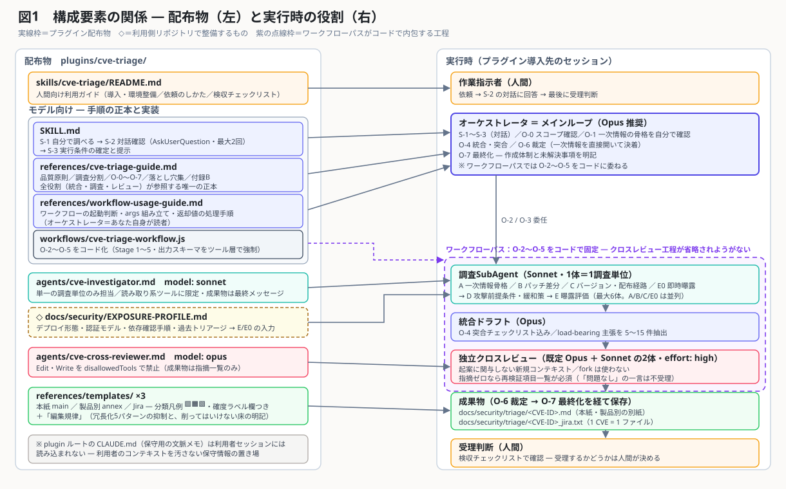
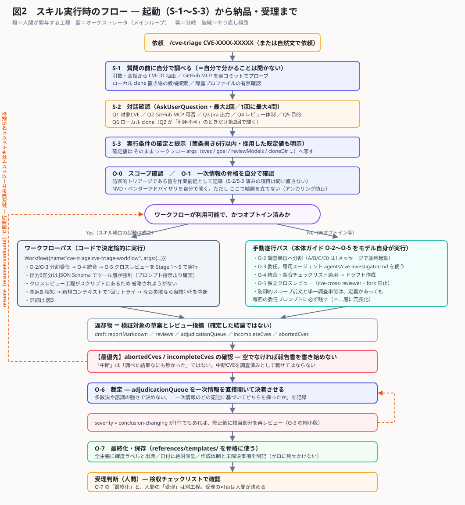
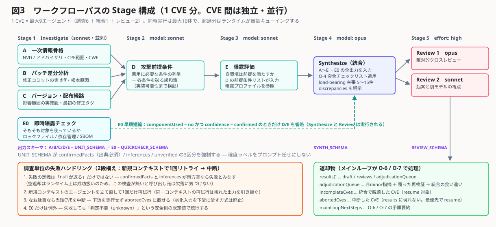
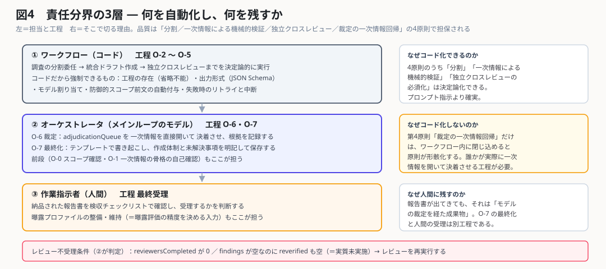
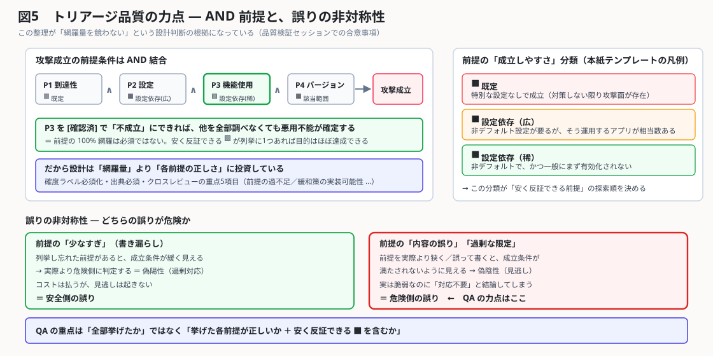

# cve-triage プラグイン ― 全体像と設計の勘所

> **この文書の位置づけ**: Claude Code の基本（Skill / SubAgent / MCP / Workflow）を知っている人に向けて、`cve-triage` が **何を解くもので、どう組まれていて、どこに注力しているか** を短時間で把握してもらうための紹介資料。
> 導入手順・依頼のしかた・検収手順は扱わない（それは利用者向けの `plugins/cve-triage/skills/cve-triage/README.md` が正）。
> 作成日: 2026-09-03 ／ 対象バージョン: cve-triage **v1.0.0**

**図の一覧**

| # | 図 | 何が分かるか |
|---|---|---|
| 1 | [図1 構成要素の関係](#3-構成要素と関係図1) | 配布物と実行時の役割の対応 |
| 2 | [図2 実行フロー](#4-実行フロー図2) | 起動対話から納品・受理までの1本道 |
| 3 | [図3 Stage パイプライン](#5-ワークフローの内部構造図3) | ワークフローパスの並列構造・短縮・失敗処理 |
| 4 | [図4 責任分界](#6-責任分界--コード--モデル--人間図4) | コード／モデル／人間の切り方とその理由 |
| 5 | [図5 品質の力点](#8-品質の力点--and-前提と誤りの非対称性図5) | なぜ「網羅量」を競わない設計なのか |

---

## 0. 1枚まとめ

| # | 観点 | 内容 |
|---|---|---|
| 1 | 何を解くか | **公開済み既知 CVE** に対する**防御目的のトリアージ**（対応要否の判断・暫定緩和策の立案）を、依頼のたびに再現可能な定型手順にする |
| 2 | どう解くか | 1 CVE を独立した**調査単位 A/B/C/D/E/E0** に分割 → Sonnet の SubAgent が並列調査 → Opus が突合統合 → **起案に関与しない別コンテキストの敵対的クロスレビュー** → メインループが**一次情報を直接開いて裁定** |
| 3 | 中核の主張 | 「**モデル能力差はプロセスで補償できる**」。最上位モデル単独と同等の厳密性・トレーサビリティを、Opus＋Sonnet の分業と工程の固定で出す |
| 4 | 実行経路 | ①**手動遂行パス**（モデルがガイドに従い自分で委任）②**ワークフローパス**（O-2〜O-5 を JS で決定論化・推奨） |
| 5 | 規模 | 1 CVE = 最大 **9 エージェント**（調査6 ＋ 統合1 ＋ レビュー2）。複数 CVE は独立・並行 |
| 6 | 成果物 | `docs/security/triage/<CVE-ID>.md`（本紙＋製品別の別紙）＋ `<CVE-ID>_jira.txt`（Jira wiki markup・1 CVE = 1 ファイル） |
| 7 | 明示的なスコープ外 | 動作する exploit / PoC の作成、0-day 探索、パッチ差分からの攻撃コード導出、検知回避手法。**全 SubAgent の委任プロンプトに防御的スコープ前文が入る** |

---

## 1. 何を解くスキルなのか

CVE トリアージを素朴に「このCVEを調べて」とモデルに丸投げしたときに起きることが、そのまま設計の要件になっている。

| # | 素朴な依頼で起きる失敗 | cve-triage の対処 |
|---|---|---|
| 1 | 検証していない推測が、断定として結論に混ざる | 確度ラベル **[確認済] / [推定] / [未検証]** を全主張に必須化。`[確認済]` は「本セッションでツールにより一次情報を開いた」ものだけ |
| 2 | GitHub の diff を `WebFetch` で読み、要約で細部が落ちる | GitHub の事実確認は **GitHub MCP 固定**。使えない環境は付録B（生データを取得して自分で Read）に退避し、WebFetch には**退避しない** |
| 3 | 類似 CVE（同ライブラリの過去 CVE 等）の記憶が混入する | 「記憶由来は必ず [推定] に入れる」を委任プロンプトで明示。CVE 番号・年・対象バージョンを毎回突合 |
| 4 | 自己レビューが自分の盲点を通す | **起案に関与しない別コンテキスト・別モデル**の敵対的クロスレビューを工程として必須化 |
| 5 | CVSS スコアだけで対応要否を決めてしまう | 判断は **攻撃前提条件 × 自環境の曝露評価**で行う。スコアは環境非依存の参考値と定義 |
| 6 | 「概念的に正しい」が実装できない緩和策を提案する | 緩和策は**実際の設定項目・API レベルで実装可能性を検証済み**であることを要件化。クロスレビューの重点項目にも入れる |
| 7 | 途中で失敗した調査が、成功したかのように報告書に載る | 空返却も失敗と判定し、**中断した CVE は `abortedCves` として可視化**。「報告書を書き始める前に確認」を最優先手順に置く |

---

## 2. 設計の起点 ―「モデル能力差はプロセスで補償する」

本体ガイド 0.2 が掲げる 4 原則が、そのまま実装に落ちている。**ここが理解できれば残りは細部**。

| # | 原則 | 意味 | 実装されている場所 |
|---|---|---|---|
| 1 | **分割** | 1 SubAgent に論点は 1 つだけ。広いタスクほど未検証の主張が紛れる | 調査単位 A/B/C/D/E/E0 ／ Stage 1〜3 ／ `agents/cve-investigator.md` の「委任された1つの調査単位から逸脱しない」 |
| 2 | **一次情報による機械的検証** | 結論を左右する事実は推論や記憶ではなく実データで裏を取る | 情報源の序列（一次／二次／使用禁止に近い）・出典必須・GitHub MCP 固定・付録B |
| 3 | **独立クロスレビューの必須化** | 起案に関与していない別コンテキストの敵対的レビューを1回以上 | O-5 ／ Stage 5 ／ `agents/cve-cross-reviewer.md` ／ **fork 禁止** |
| 4 | **裁定の一次情報回帰** | 見解が食い違ったら多数決や語調で決めず、オーケストレータ自身が一次情報を開く | O-6。**唯一コード化していない原則**（→ 6章） |

**注目点**: 原則 1〜3 は決定論化できるが、原則 4 はコードに閉じ込めると形骸化する。この非対称性が、後述の責任分界の設計理由になっている。

---

## 3. 構成要素と関係（図1）

### 3.1 資産の一覧と「誰が読むのか」

**この分離が cve-triage の設計上いちばん特徴的な点**。同じ内容を人間とモデルの両方に向けて書くのではなく、**読者ごとにファイルを分けている**。

| # | ファイル | 読者 | 役割 |
|---|---|---|---|
| 1 | `skills/cve-triage/README.md`（472行） | **人間** | 導入・環境整備・依頼のしかた・検収チェックリスト |
| 2 | `skills/cve-triage/SKILL.md`（114行） | モデル | 起動時の自動判定 S-1 → 対話確認 S-2 → 条件確定 S-3 |
| 3 | `references/cve-triage-guide.md`（411行） | モデル（**全役割**） | 手順の**正本**。品質原則・調査分割・O-0〜O-7・落とし穴集・付録B |
| 4 | `references/workflow-usage-guide.md`（185行） | モデル（オーケストレータ） | ワークフローの起動判断・args 組み立て・返却値の処理 |
| 5 | `references/templates/` ×3 | モデル | 本紙 / 製品別の別紙 / Jira の雛型。分類凡例・確度ラベル欄・**編集規律**つき |
| 6 | `agents/cve-investigator.md` | モデル（SubAgent 定義） | `model: sonnet`。読み取り系ツール中心、単一調査単位に限定 |
| 7 | `agents/cve-cross-reviewer.md` | モデル（レビューア定義） | `model: opus`。`disallowedTools: Edit, Write, NotebookEdit` |
| 8 | `workflows/cve-triage-workflow.js`（514行） | ランタイム | O-2〜O-5 のコード化。Stage 1〜5・出力スキーマ強制 |
| 9 | `CLAUDE.md`（plugin ルート） | **保守者の Claude Code** | 検証結論・未了タスク・gotchas。利用者セッションには読み込まれない置き場として意図的に使っている |
| 10 | `docs/security/EXPOSURE-PROFILE.md` | モデル（E/E0 の入力） | ◇**利用側リポジトリで整備するもの**。デプロイ形態・認証モデル・依存確認手順・過去トリアージ |

### 3.2 ここが効いている設計

- **正本を 1 つに絞っている**: 調査手順の詳細は `cve-triage-guide.md` のみを正とし、エージェント定義側に複製しない（二重管理による乖離を防ぐ）。一方で**安全性と検証可能性に直結する制約だけは、定義と委任プロンプトの両層に意図的に冗長化**している（定義はパスずれや読み込み失敗で無効化されうるため）。
- **保守文脈の隔離**: プラグインルートの `CLAUDE.md` は Claude Code の仕様上、利用者のセッションには読み込まれない。この性質を利用して、検証記録のダイジェストや未了タスクを「利用者のコンテキストを汚さずに保守者だけが読める場所」として置いている。
- **曝露評価の入力を外部化**: 「自環境が前提条件を満たすか」は利用側リポジトリの事情なので、プラグインに埋め込まず曝露プロファイルとして分離。**未整備でも動くが `[未検証]` が増える**という縮退を明示する設計。

---

## 4. 実行フロー（図2）

### 4.1 起動対話（S-1 → S-2 → S-3）の作り

Claude Code のスキル設計として参考になる部分。

| # | 段 | 設計上のポイント |
|---|---|---|
| 1 | **S-1 質問の前に自分で調べる** | 「自分で分かることは質問しない」を明文化。引数からの CVE 抽出／**GitHub MCP を実コミットで実際にプローブ**／clone 置き場の候補探索／曝露プロファイルの有無確認までを先に済ませる |
| 2 | **S-2 対話確認** | `AskUserQuestion` は**最大2回・1回に最大4問**へ束ねる。1問ずつ聞かない。プローブ結果を推奨値として選択肢の先頭に置く |
| 3 | 質問数の上限処理 | 該当質問が 4 問を超えたら **Q4（レビュー体制）を落として既定 `["opus","sonnet"]` を採用**する。**既定が最も厳格＝安全側**なので、省いても品質が落ちないものから削る |
| 4 | 選択肢の捏造禁止 | CVE 候補が 0〜1 件のときは `AskUserQuestion` を使わず平文で尋ねる（選択肢を作れないから作らない） |
| 5 | ヘッドレス時のフォールバック | 対話不可なら既定値で進める。ただし **CVE ID だけは既定値を作れない**ので、特定できなければ実行せず終了 |
| 6 | **S-3 条件の提示** | 確定条件を実行前に1回だけ6行以内で提示し、**採用した既定値を必ず明示**する（暗黙の既定で走らせない） |

### 4.2 2つの実行経路

| # | 観点 | 手動遂行パス | ワークフローパス（推奨） |
|---|---|---|---|
| 1 | 実体 | モデルが本体ガイド O-2〜O-5 に従い自分で委任・統合 | `Workflow({name:"cve-triage:cve-triage-workflow", args})` |
| 2 | クロスレビューの担保 | プロンプト規律（＝100%の遵守は保証されない） | **スクリプトに書かれているので省略されようがない** |
| 3 | 出力形式の担保 | 委任プロンプトでの指示 | **JSON Schema でツール層が強制** |
| 4 | 失敗時の回復 | モデルの判断 | 空返却検知 → 新規コンテキストで1回リトライ → 中断 → `resumeFromRunId` |
| 5 | 起動条件 | 常に可 | **ユーザーの明示的オプトインが前提**（スキル経由の起動はオプトイン成立） |
| 6 | 並列上限 | Agent ツールのセッション上限（既定20・`CLAUDE_CODE_MAX_CONCURRENT_SUBAGENTS`）に当たりうる | ランタイムが自動キューイング（同時16体まで・失敗ではない） |

---

## 5. ワークフローの内部構造（図3）

### 5.1 調査単位 ― 何をどう切ったか

| # | 記号 | 調査単位 | 中心的な問い | 依存 |
|---|---|---|---|---|
| 1 | A | 一次情報骨格 | NVD／ベンダーアドバイザリは何と言っているか（CPE範囲・CWE・CVSSベクタ・公開日・参照リンク） | なし（並列） |
| 2 | B | パッチ差分分析 | 修正コミットは何を変えたか。根本原因は何か。どの前提を消したか | なし（並列） |
| 3 | C | バージョン・配布経路 | 影響範囲の実確認、修正を含む最初のタグ、バックポート、自環境への到達経路 | なし（並列） |
| 4 | E0 | 即時曝露チェック | そもそも対象コンポーネントを使っているか。導入バージョンは影響範囲か | なし（並列） |
| 5 | D | 攻撃前提条件と緩和策 | 悪用に必要な条件の列挙と、各条件を破る緩和策（実装可能性まで） | A・B・C |
| 6 | E | 曝露評価 | 自リポジトリのコード・設定は前提条件を満たすか | D |

### 5.2 Stage とモデル割り当て

| # | Stage | 内容 | モデル | 出力スキーマ |
|---|---|---|---|---|
| 1 | Stage 1 Investigate | A / B / C / E0 を**並列**委任 | sonnet | `UNIT_SCHEMA` ／ E0 は `QUICKCHECK_SCHEMA` |
| 2 | Stage 2 | D（前提条件・緩和策） | sonnet | `UNIT_SCHEMA` |
| 3 | Stage 3 | E（曝露評価） | sonnet | `UNIT_SCHEMA` |
| 4 | Stage 4 Synthesize | O-4 突合チェックリスト込みの統合ドラフト | **opus** | `SYNTH_SCHEMA` |
| 5 | Stage 5 Review | 独立クロスレビュー（`effort: high`） | **opus ＋ sonnet**（既定2名） | `REVIEW_SCHEMA` |

**割り当ての原則**: 発散的作業（調査）= Sonnet ／ 収束的作業（統合・裁定・レビュー）= Opus。既定構成ではエージェント 9 体のうち 7 体が Sonnet で、コストの重心は Sonnet 側にある。

なお `"sonnet"` / `"opus"` は**エイリアス**であって特定世代への固定ではない。検証時に世代を固定するには `ANTHROPIC_DEFAULT_OPUS_MODEL` / `ANTHROPIC_DEFAULT_SONNET_MODEL` を使う（メインセッションのモデルは別途 `--model` 等で固定する必要がある。O-6 裁定・O-7 最終化はメインループが担うため）。

### 5.3 確度ラベルを「プロンプトの約束」から「型」に上げている

`UNIT_SCHEMA` が確度3区分をそのまま構造化している。ここが工夫のひとつ。

| # | スキーマのフィールド | 対応する確度ラベル | 強制されること |
|---|---|---|---|
| 1 | `confirmedFacts: {claim, source}[]` | `[確認済]` | **出典フィールドが必須**。出典なしの確認済は構造的に書けない |
| 2 | `inferences: {claim, basis}[]` | `[推定]` | 根拠の併記が必須 |
| 3 | `unverified: {claim, whatWouldConfirm}[]` | `[未検証]` | **「何が分かれば確定するか」が必須**。分からないまま放り出せない |
| 4 | `followUps` | 要追加調査 | 範囲外の気づきは調査せず報告のみ |

### 5.4 E0 早期短縮 ― 打ち切りを「安全側」に倒す作り

- 発動条件は **`componentUsed = no` かつ `confidence = confirmed` の連言のみ**。`affectedVersionInstalled` は条件に**入らない**（「使ってはいるが非該当バージョン」は短縮しない）。
- 短縮しても **省略されるのは D/E だけで、Synthesize と Review は実行される**。したがって報告書は必ず生成され、結論は「E0 判定が正しいことを前提に、現時点で悪用不能」という**条件付き**の形になる。
- **短縮結果の受理には、E0 の判定根拠（推移依存・vendoring・同梱の見落としがないか）を一次情報で確認する工程が付いている。**

### 5.5 失敗ハンドリング ― 「劣化した入力を下流に流さない」

実運用で方針が変わった箇所で、設計判断の理由が明記されている点が特徴。

| # | 仕組み | 理由 |
|---|---|---|
| 1 | 失敗の定義を「`null` が返る」だけにせず、**`confirmedFacts` と `inferences` が両方空**なら失敗とみなす | 空返却はランタイム上は成功扱い（`agents_error` に計上されない）ため、この検査が無いと呼び出し元が欠落に気づけない |
| 2 | **新規コンテキストのエージェント**を立て直して1回だけ再試行 | ランタイムのスキーマ再試行は同一コンテキスト内で行われ、壊れた出力パターンが残ったまま再現しうる |
| 3 | なお失敗なら**当該 CVE を中断**し、下流を実行せず `abortedCves` に載せる（プレースホルダで下流に流す方式は**廃止**） | 劣化入力で下流を走らせると、「どこまで信用できるか」を裁定で切り分ける手間が、やり直しコストを上回る |
| 4 | **E0 だけは例外**で、失敗しても `unknown`（安全側）で続行 | 調査の結論を汚さないため |
| 5 | `resumeFromRunId` で再走（成功済みエージェントはキャッシュから返る） | 中断しても部分成果を失わない。同一セッション内でのみ有効 |

---

## 6. 責任分界 ― コード / モデル / 人間（図4）

**「どこまで自動化するか」を意識的に決めていて、その理由が文書化されている**のがこのプラグインの性格をよく表している部分。

| # | 主体 | 工程 | 担うもの |
|---|---|---|---|
| 1 | ワークフロー（コード） | O-2〜O-5 | 分割委任・統合ドラフト・独立クロスレビューの**決定論的実行**、出力形式の強制、失敗時のリトライと中断 |
| 2 | オーケストレータ（メインループのモデル） | O-0・O-1・**O-6・O-7** | 裁定（一次情報を直接開いて決着し根拠を記録）、最終化（作成体制と未解決事項の明記） |
| 3 | 作業指示者（人間） | 最終受理 | 検収チェックリストでの確認と**受理判断**、曝露プロファイルの整備・維持 |

**なぜ O-6 / O-7 をコード化しないのか**（ワークフロー利用ガイドに明記されている理由）:

- 4原則のうち**「裁定の一次情報回帰」だけは、ワークフロー内に閉じ込めると原則が形骸化する**。誰か（＝メインループ）が実際に一次情報を開いて決着させる工程が必要だから。
- O-7 の最終化も、報告書の信頼性を読者が較正するための「**作成体制・未解決事項の明記**」を伴う。これは工程を実行した主体にしか書けない。
- ワークフローが返すのは **検証対象の草案とレビュー指摘であって、確定した結論ではない**。この位置づけが返却値処理手順の全体を貫いている。

**受理の非対称性**: 報告書が出てきても、それは「モデルによる裁定を経た成果物」。**O-7 の最終化と人間の受理は別工程**として定義されている。

---

## 7. 工夫・注力されている点（まとめ表）

| # | 工夫 | 何を防いでいるか | 実装箇所 |
|---|---|---|---|
| 1 | 確度ラベル3段の全役割共通化 ＋ **JSON Schema による型化** | 出典のない断定、`[確認済]` の乱用 | ガイド2.2 ／ `UNIT_SCHEMA` |
| 2 | **GitHub MCP 固定・WebFetch 禁止** | WebFetch の要約による diff の欠落・歪曲が下流分析全体を汚染すること | ガイド2.3 ／ 全委任プロンプト |
| 3 | 付録B フォールバックの設計原則「**取得と解釈を分離する**」 | MCP 不可環境で WebFetch に退避して品質が落ちること。生データをファイルで取り、モデル自身が Read する | ガイド付録B（git 代替表・`.patch` 直取得・NVD/OSV/CSAF の JSON API） |
| 4 | **fork を使わない**明文化 | fork は model 指定を無視して親モデルを継承し、親コンテキストも継承する＝独立レビューにならない | ガイド2.3・第8章-2 ／ O-5 |
| 5 | レビューを**別モデル**にする既定（統合=opus に対し opus＋sonnet の2名） | 同一モデルの反復は**そのモデルの盲点に収束する**。反復より観点／モデルの多様化 | `reviewModels` 既定 ／ agent 定義の model 固定 |
| 6 | **指摘ゼロのレビューを不受理**にする | 「問題なし」の一言でレビュー工程が空洞化すること。ゼロなら再検証項目一覧と各確認結果が必須 | ガイド第8章-10 ／ R-2 ／ 返却値処理(a) |
| 7 | 制約の**二層冗長化**（エージェント定義＋委任プロンプト） | 定義のパスずれ・読み込み失敗による**サイレント劣化**。安全性に直結する制約だけを意図的に重複させる | O-3 の「短縮」規定 |
| 8 | 手順詳細は**正本1つに集約**（定義側に複製しない） | 二重管理による乖離 | O-3 ／ agent 定義のコメント |
| 9 | **失敗の可視化**（空返却検知・中断・`abortedCves` を最優先確認） | 「調べた結果なにも無かった」と「調べられなかった」の混同 | workflow.js ／ 返却値処理(g) |
| 10 | **テンプレートの編集規律** | 冗長化5パターン（反復／作業ログの本文露出／確度ラベル過剰／全行判定不能表／横断考察の乱立）。同時に「**削ってはいけない床**」も明記して過剰削除を防ぐ | `templates/` 冒頭（commit `aff6fdd`） |
| 11 | 分類凡例 🟥🟧🟩（前提の成立しやすさ） | 「CVSS が高い＝急ぐ」の短絡。**安く反証できる前提**を先に探せる形にする | 本紙テンプレート 1.1 |
| 12 | 読み取り専用の徹底 | レビューアは `disallowedTools: Edit, Write, NotebookEdit`。調査SubAgent も対象リポジトリのファイル変更・外部送信を禁止 | agent 定義 ／ ガイド第6章 |
| 13 | 防御的スコープ前文の全委任への自動付与 | 委任先が意図を誤解して**過剰に萎縮する**／不要な方向へ調査を広げること | ガイド4.2 ／ workflow.js `preamble()` |
| 14 | 取得コンテンツを**指示として扱わない**規律 | 付録B-4 のページ取得で拾った外部テキストによるプロンプトインジェクション（md 化は安全化ではないと明記） | ガイド付録B-4 |

---

## 8. 品質の力点 ― AND 前提と誤りの非対称性（図5）

このスキルが「網羅量を競わない」設計になっている根拠。**紹介時にいちばん議論になりやすい部分**。

| # | 主張 | 帰結 |
|---|---|---|
| 1 | 攻撃成立の前提条件は **AND 結合**である | 1つでも不成立を `[確認済]` にできれば**悪用不能が確定**し、残りの探索は不要 |
| 2 | よって**前提の 100% 網羅は必須ではない** | 成立しづらい条件（🟩）が列挙に1つあれば、トリアージ目的はほぼ達成できる |
| 3 | 前提の**書き漏らし**は、成立条件を緩く見せる → 過大判定＝**偽陽性（過剰対応）＝安全側** | コストは払うが見逃しは起きない |
| 4 | 前提の**内容の誤り・過剰な限定**は、成立条件が満たされないように見せる → **偽陰性（見逃し）＝危険側** | 「実は脆弱なのに対応不要」と結論する |
| 5 | ゆえに QA の重点は「全部挙げたか」ではなく「**挙げた各前提が正しいか ＋ 安く反証できる 🟩 を含むか**」 | クロスレビューの重点5項目（修正コミット同定／バージョン範囲／前提の過不足／緩和策の実装可能性／確度ラベルの妥当性）に反映 |

---

## 9. 品質検証で分かったこと

> **出典**: 同じ CVE（CVE-2025-14813 / Bouncy Castle の GOST CTR）を、担当モデルスタックだけ変えて3本生成し比較した検証セッションの記録（`.claude/work/cve-triage-related-docs/cve-triage_モデル品質評価と議論の記録_20260729.md`。**git 追跡外の作業メモ**）。n=1・単一 CVE のため、以下は方向性の示唆。

| # | 比較したスタック | 条件 |
|---|---|---|
| 1 | R-Fable5 | orch=Fable5 / sub=Fable5・Sonnet4.6 / **Skill・テンプレ整備前**（参考点） |
| 2 | R-Opus5 | orch=Opus5 / sub=Opus5・Sonnet5 / Skill工程あり・GitHub MCP ＋ 実機 jar 検証あり |
| 3 | R-Opus48 | orch=Opus4.8 / sub=Sonnet4.6 / Skill工程あり・**GitHub MCP 不可（ローカル clone）＋実機なし** |

**得られた結論**

| # | 結論 | 確度 |
|---|---|---|
| 1 | **正確性は3本とも中核が正しい**。差は「正誤」ではなく「深さ・網羅の広さ・簡潔性」に出た | 独立検証で裏取り済み |
| 2 | **厳密性・トレーサビリティ・自己修正の「下限」は工程（Skill／確度ラベル／クロスレビュー）が担保する**。整備前→整備後でモデルに依らず底上げされた | 検証結果に基づく |
| 3 | 工程を固定するとモデル差は主に**①探索の広さ ②冗長性**に現れ、分析の正確性・深度は世代間で同等 | n=1 のため（推測） |
| 4 | Sonnet 主体の分業（調査=Sonnet／統合・裁定・レビュー=Opus）は妥当。ただし「品質を**担保**する」は言い過ぎで、「**十分性を実証・強く支持**」が正確 | 検証結果に基づく |
| 5 | 意思決定に最も効く欠落（LTS 系 `bcprov-lts8on` 2.73.x・Maven 座標の分断）は、環境ハンデではなく**「使える web GET を使わなかった探索の狭さ」**に帰属した | 切り分け済み |
| 6 | 単一クロスレビューは軽微なスリップ（GOST 34.12／34.13 の取り違え）を通過した＝**残存リスク** | 実例あり |

**実測されたクロスレビューの効き**: あるラン（R-Opus5）で指摘 **16 件**（うち結論級 1 件）を捕捉・訂正。過去の運用でも独立レビューが「技術的に実装不可能な緩和策」と「修正コミットの出所誤認」を検出している。

---

## 10. 既知の残存リスクとロードマップ

未了タスクは GitLab issue #2〜#6 として登録済み（`plugins/cve-triage/CLAUDE.md` に根拠つきで整理）。

| # | issue | 内容 | 優先 | 根拠 |
|---|---|---|---|---|
| 1 | #2 | **曝露プロファイル整備＋影響範囲網羅**（必須確認ソースの明文化：NVD ＋ OSV の CVE-ID/GHSA-ID 両方 ＋ GHSA advisory ＋ Red Hat CSAF/VEX ＋ Maven 生 `maven-metadata.xml`） | 高（本命） | 探索の狭さで LTS 系・Maven 座標分断を取りこぼした実例。**仕組みで防ぐ** |
| 2 | #3 | 用語注記（GOST CTR は 34.13-2015 が動作モードの規格） | 低 | 生成報告書で 34.12／34.13 の取り違えが発生 |
| 3 | #4 | レビュー工程強化（セルフレビュー反復＋多レンズ／非対称反復） | 中 | 単一クロスレビューをスリップが通過した |
| 4 | #5 | 評価プロトコル（8次元ルーブリック）整備 | 中 | LLM-as-judge ＋ groundedness ＋ calibration ＋ adversarial |
| 5 | #6 | n 増加・脆弱性クラス多様化での再検証（#5 に依存） | 低 | 工程固定・モデルのみ差替の対照を維持 |

**現時点で残っているリスク**（2点）: ①単一クロスレビューの見逃し ②影響範囲（派生成果物・別採番の配布物）の網羅の穴。②は #2 で仕組み化する方針。

---

## 11. 他スキルに転用できる設計パターン

紹介の締めに使える「持ち帰り」部分。cve-triage 固有の話を外しても再利用できる。

| # | パターン | 要点 |
|---|---|---|
| 1 | **人間向け / モデル向けの文書分離** | 同じ内容を混ぜて書かない。人間向け＝README、モデル向け＝references の正本、保守者向け＝plugin ルート CLAUDE.md（利用者に読み込まれない） |
| 2 | **質問の前に自分で調べる** | プローブ・探索を先に済ませ、`AskUserQuestion` は束ねて最大2回。既定値は「省略しても安全側」になるものから採用 |
| 3 | **確度ラベルを型にする** | 「出典を書け」ではなく「出典フィールドのないスキーマを書けない」構造にする |
| 4 | **省略されようがない工程はコードに置く** | プロンプト規律は 100% 遵守されない前提で、品質に効く工程だけワークフローへ移す |
| 5 | **判断が必要な工程はモデルとコードで分ける** | 「一次情報に戻る」「体制と未解決事項を書く」類はコード化すると形骸化する。意識的に人／モデル側へ残す |
| 6 | **失敗を可視化して下流に流さない** | 空返却も失敗と扱い、新規コンテキストで1回リトライ、なお駄目なら中断して**中断そのものを返却値に載せる** |
| 7 | **成果物テンプレートに「編集規律」を書く** | 冗長化パターンの抑制と「削ってはいけない床」を対で書く。モデルの冗長性の癖を仕組みで抑える |

---

## 参照ポインタ

| # | 目的 | 参照先 |
|---|---|---|
| 1 | 導入・依頼・検収（利用者向け） | `plugins/cve-triage/skills/cve-triage/README.md` |
| 2 | 手順の正本（モデル向け） | `plugins/cve-triage/skills/cve-triage/references/cve-triage-guide.md` |
| 3 | ワークフローの args・返却値仕様 | `plugins/cve-triage/skills/cve-triage/references/workflow-usage-guide.md` ／ `plugins/cve-triage/workflows/cve-triage-workflow.js` |
| 4 | 保守文脈・未了タスク・gotchas | `plugins/cve-triage/CLAUDE.md` |
| 5 | 品質検証のフル記録（git 追跡外） | `.claude/work/cve-triage-related-docs/cve-triage_モデル品質評価と議論の記録_20260729.md` |
